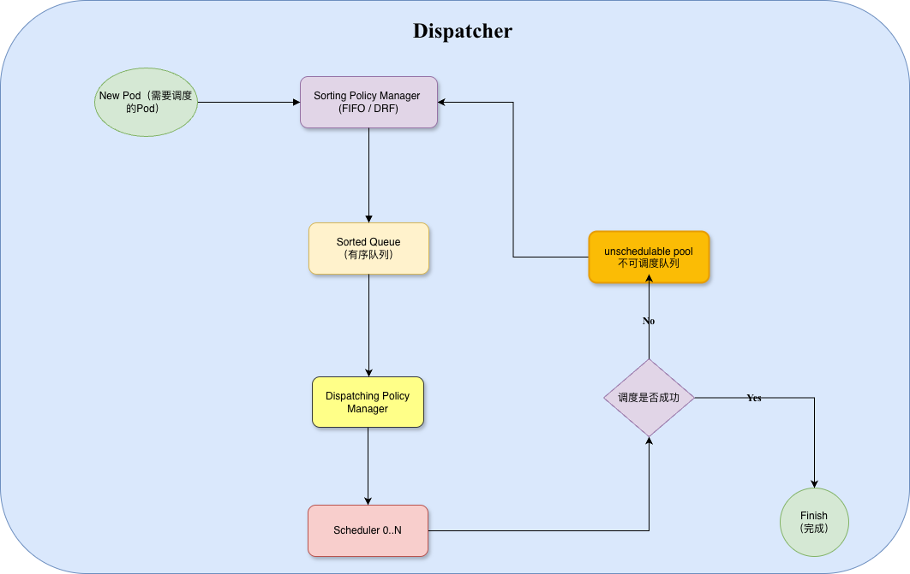
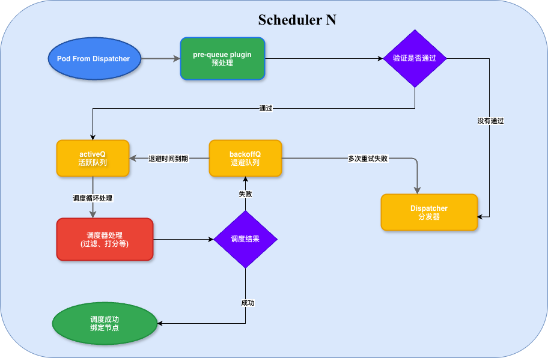

# 第三章 分布式 Kubernetes 调度器系统架构

本章系统阐述本文所研究的分布式 Kubernetes 调度器架构。首先给出系统的总体视图，说明各组件的职责与交互（§3.1）；随后详细讨论基于 etcd 的三步事务写入模型（§3.2）；接下来分别展开 Dispatcher 的内部数据结构与 Pod 流转过程（§3.3）以及单个 Scheduler 实例的内部调度流程（§3.4）；最后对全章的关键设计要点进行总结（§3.5）。

## 3.1 系统总体架构

本文所研究的分布式 Kubernetes 调度器由三类核心组件组成：Dispatcher、Scheduler、以及底层的 Kubernetes API Server 与 etcd 存储。图 3-1 展示了系统的总体架构。

**图 3-1  基于 etcd 的分布式 Kubernetes 调度器系统架构**

图 3-1 中，用户与集群控制平面组件（如 kube-controller-manager、kubelet）通过 API Server 与 etcd 交互；本文所关注的分布式调度器由 Dispatcher 与 N 个 Scheduler 实例构成，二者通过 API Server（进而通过 etcd）间接通信，不存在任何直接的 RPC/gRPC 连接。三条关键的写路径分别是：① dispatching（Dispatcher 写入 Pod 的 `scheduler-name` 注解）、② assuming（Scheduler 内部 Reserve 阶段将 Pod 标记为已选定节点，并写入 `assumed-node` 注解）、③ binding（Scheduler 内部的 Binder 模块调用 Bind 子资源 API 完成最终绑定）。

### 3.1.1 Dispatcher

Dispatcher 是全集群唯一活跃的分发实例（通过 Leader Election 机制保证高可用），承担着**将待调度 Pod 分配到具体 Scheduler 实例**的职责。Dispatcher 内部由四个模块组成：

- **Sort Policy Manager**：待调度 Pod 的排序策略，默认采用 FIFO；
- **Dispatching Policy Manager**：分发策略，默认采用 MaxIdle 负载均衡策略，即选择当前处理能力剩余最多的 Scheduler；
- **Node Partition Manager**：维护"Partition 1..N"的节点分区表，每个分区归属一个 Scheduler 实例；
- **Scheduler Maintainer**：维护 Scheduler 实例的注册与健康状态（Scheduler 0..N）。

### 3.1.2 Scheduler

每个 Scheduler 实例只负责被分配到自己的 Pod，并只对自己分区内的节点执行 Filter/Score 决策。图 3-1 中"Scheduler 0"内部展开了三个主要子系统：

- **Scheduling**：正常调度路径，包含 Pre-Queue 插件（Pod 入队前的预处理）、Filtering 插件（过滤不满足硬约束的节点）、Scoring 插件（对候选节点打分）；
- **Preempting**：抢占路径，当资源不足时通过 Victims Searching Plugins 寻找可抢占的低优 Pod、Candidates Sorting Plugins 对抢占候选进行排序；
- **Binder**：绑定路径，包含 Node Conflict Resolver（节点分区归属校验，见第 4 章 Layer 0）、Preemption Executor（执行抢占决策）、Pod Binder（调用 Bind API 完成最终绑定）。

**值得注意的是**：图 3-1 所示的 Binder 位于 Scheduler 实例内部，这正是本文第 5 章 ENO 架构改造的结果。原 Gödel 架构中 Binder 是独立部署的 Deployment，两种部署形态的对比与切换机制将在第 5 章展开。

### 3.1.3 API Server 与 etcd

API Server 是所有组件唯一的通信中介。Dispatcher 与 Scheduler 之间没有直接连接，它们通过 API Server 的 Watch/Informer 机制观察对方对 Pod 资源的修改，实现事件驱动的松耦合协作。etcd 作为 API Server 的后端存储，通过 Raft 协议提供强一致性保证，并通过其原子写入语义（如 `resourceVersion` 乐观并发控制、Bind 子资源的原子性）为整个分布式调度器的一致性提供底层依赖。

## 3.2 基于 etcd 的三步事务写入模型

图 3-1 中标注的三条写路径 ① dispatching、② assuming、③ binding 构成了本文所研究的分布式调度器的核心事务模型。每一步都是对 etcd 的一次原子写入，且都通过 Kubernetes API Server 中转，得益于 etcd 的强一致性保证，这三步写入满足如下性质：

**图 3-2  基于 etcd 的三步事务写入时序（dispatching → assuming → binding）**

**（1）① dispatching 步骤**。Dispatcher 通过 `PatchPod` 操作，在 Pod 的注解字段中写入 `godel.bytedance.com/scheduler-name={selectedScheduler}`。这一步操作携带 Pod 的 `resourceVersion`，若并发情况下已有其他修改，则会由 etcd 返回 `409 Conflict`，Dispatcher 收到冲突后重新读取 Pod 并重试。这保证了同一 Pod 的分发决策**不会出现竞争条件**。

**（2）② assuming 步骤**。被分发到的 Scheduler 通过 Informer 观察到 Pod 的 `scheduler-name` 注解匹配自己，将其纳入调度循环。Filter/Score/Reserve 完成后，Scheduler 通过 `PatchPod` 写入 `godel.bytedance.com/assumed-node={selectedNode}`，同样受 `resourceVersion` 乐观并发保护。

**（3）③ binding 步骤**。Scheduler 内部的 Binder 模块（或独立 Binder，取决于部署形态）通过 Bind 子资源 API `POST /api/v1/namespaces/{ns}/pods/{name}/binding` 完成最终的绑定操作。这是与前两步性质截然不同的一步：Bind API 是 Kubernetes 定义的**特殊子资源**，其内部实现由 kube-apiserver 通过 etcd 事务保证如下语义：

> 当且仅当 Pod 的 `spec.nodeName` 为空时，允许原子设置为目标节点名；若已经设置，返回 `409 Conflict`。

这一语义**从根本上排除了同一 Pod 被绑定到两个不同节点的可能性**。任意数量的 Scheduler 实例、任意的并发度、任意的网络重排——只要它们最终都通过 Bind API 完成绑定，"任一 Pod 至多绑定到一个节点"这一核心不变量就得到 Kubernetes 集群的原子性保证。这是本文第 4 章一致性论证的最底层基石。

> 附注 3-1：上述三步事务写入模型完全依赖 etcd 与 kube-apiserver 提供的原子性语义。本文的分布式调度器**没有引入任何自研的分布式协调机制**（例如 Raft 复制、分布式锁、外部 ZooKeeper 等）——所有一致性保证都建立在 Kubernetes 已有的存储抽象之上。这一设计选择的优点是：任何一个符合 Kubernetes 规范的 kube-apiserver + etcd 部署都能天然支持本调度器，无需额外的部署依赖。

## 3.3 Dispatcher 内部：Pod 的数据结构流转

图 3-3 展示了 Dispatcher 内部 Pod 从进入到分发完成的完整流转过程。

**图 3-3  Dispatcher 内部数据结构流转：Pod 从新建到分发完成的过程**

如图 3-3 所示，一个新创建的 Pod（尚未被调度）进入 Dispatcher 的流转过程如下：

**（1）进入 Sorting Policy Manager**。当 Dispatcher 通过 Informer 观察到一个 `spec.nodeName == ""` 且 `scheduler-name` 注解为空的新 Pod 时，将其送入 Sorting Policy Manager。当前实现采用 FIFO 排序（可扩展为 DRF 等公平共享算法）；

**（2）进入 Sorted Queue（有序队列）**。经排序后的 Pod 进入有序队列，按照策略产出的次序等待分发；

**（3）交由 Dispatching Policy Manager**。从有序队列中弹出的 Pod 进入分发策略模块，该模块根据 Pod 的 PodGroup 归属、Owner 亲和、以及各 Scheduler 实例的负载状况，选择目标 Scheduler；

**（4）通过 API Server 传递到目标 Scheduler**。分发策略选定 Scheduler 后，通过 `PatchPod` 写入 `scheduler-name` 注解（对应图 3-1 中的 ① dispatching），Pod 从此对该 Scheduler 可见；

**（5）等待调度结果**。Pod 进入所选 Scheduler 后，Dispatcher 通过 Informer 持续观察其状态。若 Scheduler 最终完成绑定（`spec.nodeName != ""`），则该 Pod 的分发任务结束（图中"Finish（完成）"节点）；

**（6）失败回退**。若 Scheduler 反馈调度失败（例如资源不足、节点分区归属漂移、多次绑定失败等），Pod 会被送入 **unschedulable pool（不可调度队列）**，等待条件改变（例如新节点加入、Pod 被删除释放资源）后重新回到 Sorting Policy Manager，进入下一轮分发。

上述流程中，**Sorting Policy Manager 与 Dispatching Policy Manager 的解耦**是一个关键设计决策：排序策略解决"下一个应该处理谁"的问题，分发策略解决"应该分给谁"的问题，两者独立扩展。例如，FIFO 排序 + MaxIdle 分发组合能够较好地满足在线服务场景的公平性需求；未来若引入 DRF 排序 + 亲和性优先分发，则可支持多租户资源公平共享。

## 3.4 单个 Scheduler 内部：Pod 的调度流程

被 Dispatcher 分发到某个 Scheduler 实例后，Pod 进入该 Scheduler 内部的调度循环。图 3-4 展示了这一过程。

**图 3-4  单个 Scheduler 内部：Pod 在活跃队列与退避队列间的流动**

图 3-4 描述的流转过程可分为如下步骤：

**（1）Pod From Dispatcher（分发到达）**。Scheduler 通过 Informer 观察到 `scheduler-name` 注解匹配自身的 Pod，将其纳入调度队列；

**（2）Pre-Queue Plugin 预处理**。在进入活跃队列前，pre-queue 插件对 Pod 进行一次预处理，主要检查 Pod 是否满足入队条件（例如 PodGroup 的成员是否齐全、亲和性依赖是否满足）；

**（3）验证是否通过**。若预处理阶段的验证不通过（例如 PodGroup 依赖尚不齐全），Pod 会被送回 **Dispatcher 分发器**，等待条件成熟后重新分发（对应图 3-3 中的 unschedulable pool 回路）；若通过，则进入 activeQ；

**（4）activeQ（活跃队列）**。活跃队列是 Scheduler 主调度循环的入口，一个后台 goroutine 不断从 activeQ 弹出 Pod 进入调度循环；

**（5）调度器处理（过滤、打分等）**。Scheduler 依次执行 Filter、Score、Reserve 阶段。Filter 阶段遍历本 Scheduler 分区内的节点，剔除不满足硬约束的节点；Score 阶段对剩余候选节点打分；Reserve 阶段将得分最高的节点标记为该 Pod 的候选节点，并在 SchedulerCache 中记录 Assumed 状态；

**（6）调度结果分支**。
- **成功**：进入"调度成功 绑定节点"分支。Reserve 完成后，Scheduler 调用 Binder（进程内或独立部署）执行 Bind API，完成绑定。绑定成功后 Pod 生命周期在本 Scheduler 内结束；
- **失败**：进入 backoffQ（退避队列）。失败原因包括节点资源不足、Filter 全部否决、Bind API 失败等；

**（7）backoffQ（退避队列）**。退避队列采用指数退避策略，Pod 在此等待一段时间后自动回流到 activeQ 进行重试；

**（8）多次重试失败**。若一个 Pod 在本 Scheduler 内经过若干次退避重试仍然无法完成绑定（例如本分区内确实无可用节点），Pod 将被送回 **Dispatcher 分发器**，触发跨实例回退（对应第 4 章 Layer 3）。

需要特别强调的是，**图 3-3 中的 "unschedulable pool → 回到 Sorting Policy Manager" 与图 3-4 中的 "多次重试失败 → 回到 Dispatcher"** 是同一个跨实例回退机制的两个侧面：Scheduler 侧决定何时放弃本地重试并回退，Dispatcher 侧决定回退回来的 Pod 何时被重新分发。这一双向协作是分布式调度器实现整体高可用的核心机制之一，其一致性证明将在第 4 章展开。

## 3.5 本章小结

本章从系统总体（§3.1）、事务模型（§3.2）、Dispatcher 内部（§3.3）、Scheduler 内部（§3.4）四个层面完整刻画了本文所研究的分布式 Kubernetes 调度器架构。全章的关键设计要点可归纳为以下三条：

**（1）无自研分布式协调机制**。整个分布式调度器完全依赖 Kubernetes 已有的 API Server + etcd 抽象，通过 Pod 注解 CAS、Bind 子资源原子性、Informer 一致性视图三种机制维持多实例并发场景下的正确性。这一设计将分布式一致性问题的解决完全交给了 etcd，本调度器不需要额外的部署依赖。

**（2）Dispatcher 与 Scheduler 的双向协作**。Dispatcher 通过分区表将节点划分给各 Scheduler，实现资源竞争的天然规避；Scheduler 通过 Pod 状态与注解反馈调度进展，触发必要的重分发。这一松耦合的双向协作既保证了并发调度的效率，也保留了失败回退的兜底能力。

**（3）关键路径均由 etcd 事务落盘**。dispatching / assuming / binding 三步事务写入都是对 etcd 的一次原子操作，任意组件在任意时刻崩溃，Pod 状态都能通过 etcd 中的持久化数据在恢复后被正确重建。特别地，binding 步骤依赖 Bind 子资源的强原子性——这是"任一 Pod 至多绑定到一个节点"这一核心不变量的最底层保证。

上述三条设计要点为第 4 章的一致性容错机制提供了论证起点：Layer 0 依赖 Pod 与 Node 注解的乐观并发；Layer 1 依赖 etcd 的原子重试；Layer 2 依赖 Informer 的一致性视图；Layer 3 依赖 Dispatcher 的重分发能力。所有四层容错都以本章描述的架构为基础展开。
