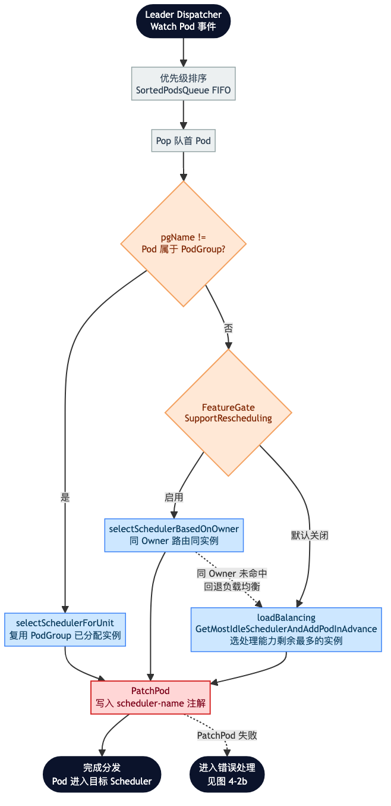
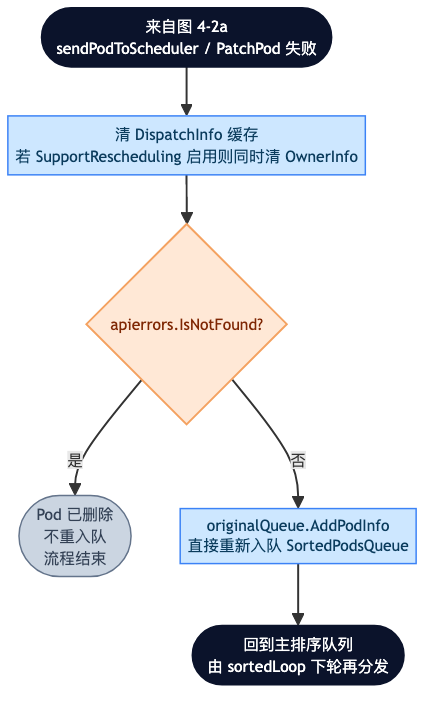
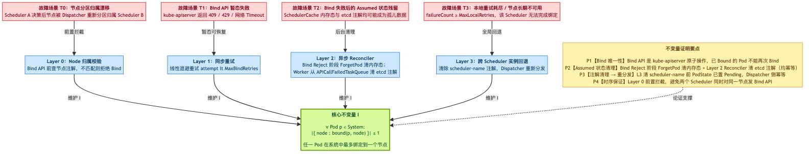

# 第四章 基于 etcd 语义的一致性容错机制

本章是全文的核心章节之一。第 3 章描述的分布式调度器架构中，多个 Scheduler 实例并发工作时不可避免地会遇到多种故障场景，如何在故障下依然维持"任一 Pod 至多绑定到一个节点"这一核心不变量，是评价一个分布式调度器正确性的最低门槛。本章将围绕四类典型威胁展开，给出对应的四层容错机制，并从形式化的角度论证不变量的维持。

## 4.1 一致性挑战与核心不变量

### 4.1.1 系统模型

本章的讨论采用如下形式化系统模型：

```
System = { Pod, Node, Dispatcher, Scheduler_1..N, APIServer, etcd }
```

其中：
- Pod 与 Node 是 Kubernetes 集群中的资源对象，其状态最终存储于 etcd；
- Dispatcher 与 Scheduler_1..N 是本文所研究的调度器组件；
- APIServer 与 etcd 提供第 2 章 §2.5 所述的三种原子性语义（`resourceVersion` 乐观并发、Watch 一致性、Bind 子资源原子性）。

### 4.1.2 核心不变量

分布式 Kubernetes 调度器需要维持的核心不变量记为 **I**：

$$
\forall \; \text{Pod } p \in \text{System}: \; \left| \{ \text{node} : \text{bound}(p, \text{node}) \} \right| \leq 1
$$

即：任意 Pod 在系统中至多被绑定到一个节点。这一不变量看似简单，但在分布式调度器场景下，多个 Scheduler 实例可能同时观察到相同的候选节点、可能同时执行 Filter/Score/Bind、可能因分区归属漂移导致同一节点被两个 Scheduler 各自认为归属自己——如何在这些并发与故障场景下始终维持 I，是本章的核心目标。

**违反 I 的严重性**：若同一 Pod 被绑定到两个节点，Kubernetes 的资源核算会出错，kubelet 会在两个节点上同时启动该 Pod 的容器，网络与存储配置将出现冲突，进而可能导致数据错乱、服务异常。这已经超出一般"性能下降"的范畴，属于**数据不一致的灾难性事故**。因此本章的容错机制不是"锦上添花"的健壮性优化，而是分布式调度器能够生产可用的**最低正确性门槛**。

### 4.1.3 Pod 生命周期与容错介入点

图 4-1 展示了 Pod 在本文调度器中的生命周期状态机，并标注了四层容错机制的介入点。


**图 4-1  Pod 生命周期状态机与 4 层容错机制介入点**

如图 4-1 所示，Pod 生命周期的主状态为：
`[*] → Pending → Dispatched → Assumed → Bound → [*]`

正常路径下，Pod 从新建（Pending）经 Dispatcher 分发（Dispatched）、Scheduler 决策（Assumed）、Bind API 成功（Bound）完成整个流程。图 4-1 中彩色分支展示了各层容错的介入点：

- **Layer 0（红色）**：Assumed → L0_Fail，节点归属校验在 Bind API 前拦截；
- **Layer 1（黄色）**：Assumed → L1_Retry → Assumed，暂态失败的同步重试；
- **Layer 2（橙色）**：L1_Retry → L2_Queue → Assumed，超同步重试上限后交由异步 Reconciler；
- **Layer 3（紫色）**：L0_Fail / L2_Queue → Pending，回到最初状态触发 Dispatcher 重分发。

## 4.2 Layer 0 — Node 分区归属前置校验

### 4.2.1 威胁 T0：节点分区归属漂移

**场景**：Scheduler A 通过 Filter/Score 决定将 Pod p 调度到 Node X，但在 Bind API 调用发生之前，Dispatcher 因节点负载重新平衡（`node-shuffler` 触发）将 Node X 从 Scheduler A 的分区剥离，改分给 Scheduler B。

**危害**：若不加拦截，Scheduler A 仍会发起对 Node X 的 Bind 尝试，与此同时 Scheduler B 也可能在自己的分区变更后开始处理与 Node X 相关的调度请求。虽然 Bind 子资源的原子性最终能防止同一 Pod 被绑定两次（本例中只涉及一个 Pod），但会产生大量无效的 Bind 请求、错误日志、以及 API Server 压力。更严重的是，这种"跨分区的 Bind 尝试"会破坏节点分区语义——每个 Scheduler 只应对自己分区内的节点做写操作。

### 4.2.2 Layer 0 的设计

节点分区的归属通过 Node 对象的注解 `eno.io/scheduler-name` 表达。Dispatcher 在做出分区决策后，通过 `PatchNode` 写入该注解；每个 Scheduler 只处理注解与自身名字匹配的节点。

Layer 0 的具体实现是**在 Bind API 调用之前对目标节点的归属注解进行一次显式校验**。校验逻辑如下：

```go
// 摘自 pkg/binder/node_validator.go
func (v *NodeValidator) Validate(nodeName string) error {
    node, err := v.nodeGetter(nodeName)
    if err != nil { return err }
    owner := node.Annotations[nodeutil.EnoSchedulerNodeAnnotationKey]

    // 注解为空：节点未被分区（例如单调度器部署），允许 Bind
    if owner == "" { return nil }

    // 注解与自己一致：归属正确，允许 Bind
    if owner == v.schedulerName { return nil }

    // 注解与自己不一致：归属漂移，返回 NodeOwnershipError
    return &NodeOwnershipError{
        Node: nodeName, Expected: v.schedulerName, Actual: owner,
    }
}
```

上述实现关键点：

- **通过 nodeGetter 抽象读取源**：不硬编码从 Informer 缓存读取或从 API Server 读取，由调用方决定。生产环境通常从 Informer 读取以获得低延迟；
- **三种归属状态明确区分**：注解为空视为"尚未分区"（允许 Bind，兼容单调度器场景）；注解与自身一致视为"归属正确"；注解与自身不一致视为"归属漂移"，返回结构化错误；
- **`NodeOwnershipError` 是可类型识别的错误**：调用方可通过 `errors.As` 判断错误类型，进而触发 Layer 3 全局回退。

### 4.2.3 Layer 0 的效果

Layer 0 是四层机制中唯一的**前置**层——它在 Bind API 之前拦截，避免了跨分区的 API 调用。当两个 Scheduler 因分区状态视图不一致都认为自己拥有 Node X 时，Layer 0 的注解查询确保**只有真实持有节点注解的那个 Scheduler 能通过前置校验**，另一个会因归属不匹配而被拦截，直接进入 Layer 3 全局回退。

这一层的正确性保证依赖于 etcd 对 Node 注解的原子性写入：当 Dispatcher `PatchNode` 修改归属注解时，任何后续从 Informer 读取到该 Node 的组件，最终都会看到修改后的注解值（Informer 通过 Watch 保证最终一致性）。虽然存在**短暂的窗口期**（旧值尚未在 Informer 中更新），但这一窗口的处理由 Layer 3 兜底：即使 Scheduler A 通过了 Layer 0（读到旧值）并调用了 Bind API，Bind API 的原子性 + Scheduler B 侧的 Layer 0 校验也能保证最终只有一个 Bind 成功。

## 4.3 Layer 1 — 同步重试

### 4.3.1 威胁 T1：Bind API 暂态失败

**场景**：Scheduler 通过 Layer 0 校验后调用 Bind API，但 API Server 因如下原因返回错误：

- `409 Conflict`：Pod 的 `resourceVersion` 已被其他修改抢先更新（例如用户 patch 了标签）；
- `429 Too Many Requests`：API Server 限流；
- 网络 timeout：临时的连接问题。

**危害**：若不重试，Pod 将长期停留在 Assumed 状态，可用性下降。

### 4.3.2 Layer 1 的设计

Layer 1 在 `embedded_binder.go` 的 `bindPodToNode` 函数中实现，核心逻辑是**指数退避 + 有限次同步重试**：

- 初始退避 `initialBackoff` = 100ms；
- 退避倍率 `backoffFactor` = 2.0；
- 最大退避 `maxBackoff` = 5s；
- 最大重试次数 `MaxBindRetries` = 3。

每次重试均在当前 goroutine 中同步执行，不涉及跨 goroutine 或跨进程通信。这样设计的原因是：

**（1）暂态失败在秒级内自愈的概率很高**。API Server 的限流和网络抖动通常持续时间短，一次立即重试往往就能成功；同步重试避免了将失败 Pod 塞入队列后再重新拉起的调度延迟。

**（2）失败次数可控**。同步重试次数硬编码为 3 次，保证 Scheduler 不会因反复重试单个 Pod 而阻塞后续调度决策——若 3 次都失败，Layer 1 立即将该 Pod 交给 Layer 2 的异步 Reconciler。

**（3）幂等性**。Bind API 本身是幂等的：若第一次 Bind 已经成功但客户端未收到响应，第二次 Bind 会因 `spec.nodeName` 已被设置而返回 `409 Conflict`，Scheduler 可将其视为成功。

## 4.4 Layer 2 — 异步 Reconciler

### 4.4.1 威胁 T2：进程内偶发错误

**场景**：Scheduler 在 Reserve 阶段将 Pod 标记为 Assumed（写入 `assumed-node` 注解，同时在 SchedulerCache 中记录节点资源占用），但随后 Bind API 失败且同步重试全部耗尽——甚至在极端情况下 Scheduler 进程本身崩溃/panic。

**危害**：Pod 在 SchedulerCache 中的 Assumed 状态成为**孤儿数据**，占用节点资源核算配额但从未真正落盘。若不清理，该节点将被 Scheduler 认为已经容纳了这个 Pod，从而拒绝为其他 Pod 分配资源，导致资源永久占用。

### 4.4.2 Layer 2 的设计

Layer 2 在 `binder_reconciler.go` 中实现，其核心数据结构是 `APICallFailedTaskQueue`——一个持久化的失败任务队列（基于 client-go 的 workqueue<sup>[36]</sup>，具备去重、限流、自动重试能力）。

流转过程如下：

**（1）失败进入队列**：Layer 1 在 3 次同步重试后仍失败，将 Pod 加入 `APICallFailedTaskQueue`；

**（2）Worker 消费**：后台 goroutine（Reconciler Worker）以并发度 K 从队列中拉取任务；

**（3）幂等清理**：Worker 首先调用 `ForgetPod(p)` 清理 SchedulerCache 中的 Assumed 状态。`ForgetPod` 对不存在的 Pod 是 no-op，因此可以安全重试；

**（4）判断后续动作**：
- 若节点归属仍属于本 Scheduler 且 Pod 还需要绑定，重新加入 activeQ 进入调度循环；
- 若节点归属已漂移或 Pod 已被删除，直接放弃并触发 Layer 3。

**进程崩溃恢复**：即使 Scheduler 进程 panic 重启，workqueue 中的任务并不因此丢失——workqueue 由 client-go 在内存中维护，但更重要的是 SchedulerCache 中的 Assumed 状态本身在进程重启后会被 Informer 重新同步（从 etcd 中读取 Pod 的最新注解，重建 Assumed 集合）。因此 Layer 2 的清理最终一致性由 etcd 的持久化 + Informer 的重建保证。

## 4.5 Layer 3 — 跨实例回退

### 4.5.1 威胁 T3：本地重试耗尽 / 节点长期不可用

**场景**：一个 Pod 在 Scheduler A 中反复失败——例如 Scheduler A 分区内确实无可用节点、或者 Node X 因硬件故障从集群中移除、或者 apiserver 长期不可达。Layer 1 与 Layer 2 都无法在本实例内解决问题。

**危害**：若无跨实例回退机制，Scheduler A 会长期卡在这个 Pod 上，本分区内其他新到达的 Pod 也会因此排队等待，最终 Scheduler A 的可用性完全丧失。

**实例级失效的回收路径**：除上述任务级故障外，Scheduler 实例**本身失效**（进程崩溃或心跳超时失活）时，其名下未完成的任务同样需要全局回收。Dispatcher 的 Scheduler Maintainer 基于实例心跳（Lease/心跳上报）进行失活判定；失效实例名下仍处于 Dispatched 状态的任务，由 PodStateReconciler 将其重置为 Pending 并清理 `scheduler-name` 等注解，随后重新进入分发流程。这是 Layer 3 回收路径在实例级故障场景下的体现，与任务级回退共用同一套"清注解 → 重分发"机制，从而保证失效实例遗留的任务不会成为孤儿数据。

### 4.5.2 Layer 3 的设计

Layer 3 的核心思想是：**放弃本实例，交还给 Dispatcher 重新分发**。图 4-2a 展示了 Dispatcher 侧的主分发流程，图 4-2b 展示了错误恢复逻辑。



**图 4-2a  Dispatcher 策略分发的决策路径（PodGroup / Owner 亲和 / 负载均衡）**



**图 4-2b  Dispatcher 侧的错误恢复流程（Layer 3 全局回退）**

Layer 3 的具体操作序列为：

**（1）Scheduler 侧清理**：Scheduler A 在决定回退时，通过 `PatchPod` 执行两步原子操作：
- 先设置 `PodState = Pending`（内存中的状态机字段）；
- 再清除 Pod 的 `scheduler-name` 注解。

**顺序至关重要**：先改状态再清注解。若顺序颠倒，Dispatcher 可能会观察到"无 scheduler-name 但 PodState = Dispatched"的中间状态，进而误判为已被分发而跳过。

**（2）Dispatcher 侧重分发**：Dispatcher 通过 Informer 观察到 `scheduler-name` 被清除的 Pod，将其重新纳入 Sorted Queue 参与下一轮分发（对应图 4-2b 中"清理 Scheduler 注解 PodState=Pending → 回到主排序队列 → 下轮重新分发"）。

**（3）幂等重分发**：Dispatcher 的 `selectScheduler` 方法是幂等的——多次调用最终会写入同一个 `scheduler-name` 注解（这一注解通过 API Server 的 Patch 语义 + `resourceVersion` 保证并发安全）。因此即使 Layer 3 触发时 Dispatcher 恰好也在处理该 Pod，也不会产生错误的分发结果。

### 4.5.3 Layer 3 与 Layer 0 的闭环

Layer 3 与 Layer 0 构成了一个自洽的闭环：

- Layer 3 清除 `scheduler-name` 注解后，Pod 重新分发给另一个 Scheduler B；
- Scheduler B 在 Bind API 之前执行 Layer 0 校验；
- 若 Node X 的归属仍为 Scheduler A（例如 Layer 3 是因为 Layer 1 耗尽而触发，与节点归属漂移无关），Layer 0 会拒绝该 Bind，再次触发 Layer 3；
- 若 Node X 的归属已漂移到 Scheduler B，Layer 0 通过，Bind API 完成。

这一闭环保证了**无论故障如何组合，Pod 最终要么被正确绑定到一个节点、要么持续处于 Pending 状态等待条件改善，而不会陷入"错误绑定"或"永久卡死"的中间态**。

## 4.6 一致性论证

本节给出四层容错机制维持核心不变量 I 的完整论证。图 4-3 综合展示了 4 类威胁、4 层防御、以及 4 项证明要点的对应关系。



**图 4-3  一致性论证：核心不变量 I 及其 4 层威胁-防御映射**

### 4.6.1 证明要点

**P1【Bind 唯一性】** 来自 Kubernetes 自身的原子性保证。Bind API 是 Pod 资源的子资源，kube-apiserver 通过 etcd 事务保证：当且仅当 Pod 的 `spec.nodeName` 为空时允许原子设置为目标节点；若已设置，返回 `409 Conflict`。这是 Kubernetes 集群层面的性质，本文只引用而不重新证明。

**P2【Assumed 状态清理】** 由 Layer 2 保证。Bind 失败时 Pod 被加入 `APICallFailedTaskQueue`，Reconciler Worker 周期性调用 `ForgetPod(p)` 清理 SchedulerCache 中的 Assumed 状态。`ForgetPod` 对不存在的 Pod 是 no-op，可安全重试；进程重启后 SchedulerCache 由 Informer 从 etcd 重新构建，Assumed 状态不会作为孤儿数据永久驻留。

**P3【注解清理 → 重分发的时序】** 由 Layer 3 的操作顺序保证。Layer 3 全局回退的操作序列必须是：
1. 先设置 `PodState = Pending`；
2. 再清除 `scheduler-name` 注解。

**反例**：若顺序颠倒（先清注解再改状态），Dispatcher 可能在中间态观察到"无 scheduler-name 但 PodState = Dispatched"的 Pod，跳过该 Pod。Dispatcher 的 `selectScheduler` 幂等，因此即使多次触发也不会产生错误的分发结果。

**P4【时序保证：Layer 0 前置拦截】** 由 Node 归属注解的原子写入 + Layer 0 校验共同保证。当 Dispatcher `PatchNode` 修改归属注解时，Kubernetes 通过 `resourceVersion` 保证原子性；Layer 0 在 Bind API 前查询该注解，只有归属与自身匹配的 Scheduler 才能通过校验。虽然 Informer 缓存可能短暂滞后，但即使两个 Scheduler 都通过了 Layer 0，P1 的 Bind API 原子性也能保证最终只有一个 Bind 成功——第二个会因 `nodeName` 已设置而返回 `409 Conflict`，触发 Layer 1 重试，进而 Layer 2/3 清理。

### 4.6.2 组合论证

现证明 P1 ∧ P2 ∧ P3 ∧ P4 ⇒ 不变量 I 永远成立。

按图 4-1 状态机的可能路径分类讨论：

**情况 1（无故障）**：Pod 从 Pending → Dispatched → Assumed → Bound。只有 Layer 0 通过校验的 Scheduler 发起 Bind API，P1 保证 Bind 的原子性，任一 Pod 至多被绑定到一个节点。I 成立。

**情况 2（T1 触发）**：Bind 失败后 Layer 1 同步重试，仍是同一个 Scheduler 试图 Bind 同一个 Pod 到同一个节点。由 P1，重试不会绑定到第二个节点。I 保持。

**情况 3（T2 触发）**：Bind 半失败或 Scheduler 进程崩溃，Pod 在 SchedulerCache 中残留 Assumed。由 P2，Layer 2 保证 Assumed 状态被 `ForgetPod` 清理，后续调度不受影响。此时 Pod 未被绑定到任何节点（Bind 失败），I 平凡成立。

**情况 4（T0/T3 触发）**：无论是节点归属漂移（T0）还是本地重试耗尽（T3），Pod 都会经 Layer 3 清除 `scheduler-name` 注解回到 Pending 状态。由 P3，操作时序正确，Dispatcher 会重新分发。分发到新 Scheduler 后走完整流程，再次遇到 Layer 0 校验（P4），归约到情况 1。I 在整个过程中不被破坏。

综上，四种情况覆盖了图 4-1 状态机的所有可能路径，且每种情况下 I 都得到维持。■

### 4.6.3 论证的形式化程度

本文的一致性论证采用**严谨自然语言 + 关键代码引用 + 状态机图**的组合方式，而非 TLA+ 等形式化验证工具（一致性属性的系统化分析框架可参见 Golab 等的工作<sup>[37]</sup>）。这一选择的理由是：

- 本文的容错机制**建立在 Kubernetes 已有的原子性保证之上**，而 Kubernetes 本身的正确性（etcd Raft、apiserver 事务）不在本文论证范围内；
- 核心不变量 I 只有一条，且直接对应 K8s 集群的可观测性质（`spec.nodeName` 单调设置）；
- TLA+ 等工具的建模成本对于工程实现来说过高，其可读性反而不如状态机图 + 证明要点。

若未来在生产环境暴露出未考虑的边界情况，可考虑将 Layer 0/3 的时序性质用 TLA+ 显式建模，作为后续研究方向（见第 7 章展望）。

## 4.7 本章小结

本章围绕核心不变量 "任一 Pod 至多绑定到一个节点" 展开，识别了分布式调度器场景下的 4 类典型威胁：

- T0：节点分区归属漂移；
- T1：Bind API 暂态失败；
- T2：进程内偶发错误；
- T3：本地重试耗尽 / 节点长期不可用。

分别设计了对应的 4 层容错机制：

- Layer 0：Bind 前置的节点归属校验；
- Layer 1：指数退避的同步重试；
- Layer 2：异步 Reconciler + APICallFailedTaskQueue；
- Layer 3：跨实例回退，清除 `scheduler-name` 注解触发 Dispatcher 重分发。

论证过程表明，四层机制的组合能够严格维持核心不变量 I，其可靠性建立在 etcd 的原子性语义（Bind 子资源原子写入、Pod/Node 注解的 `resourceVersion` 乐观并发、Informer 的最终一致性）之上。第 5 章将在本章的一致性保证基础上，进一步优化独立 Binder 的部署形态，提出面向大规模场景的进程内 Binder 架构 ENO。
