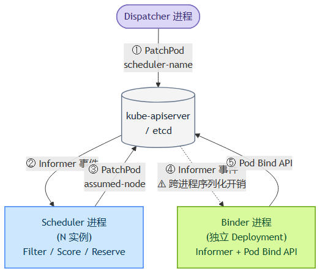
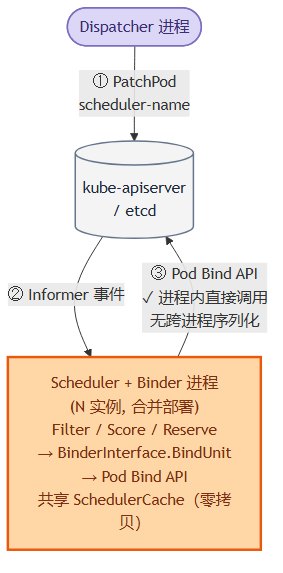
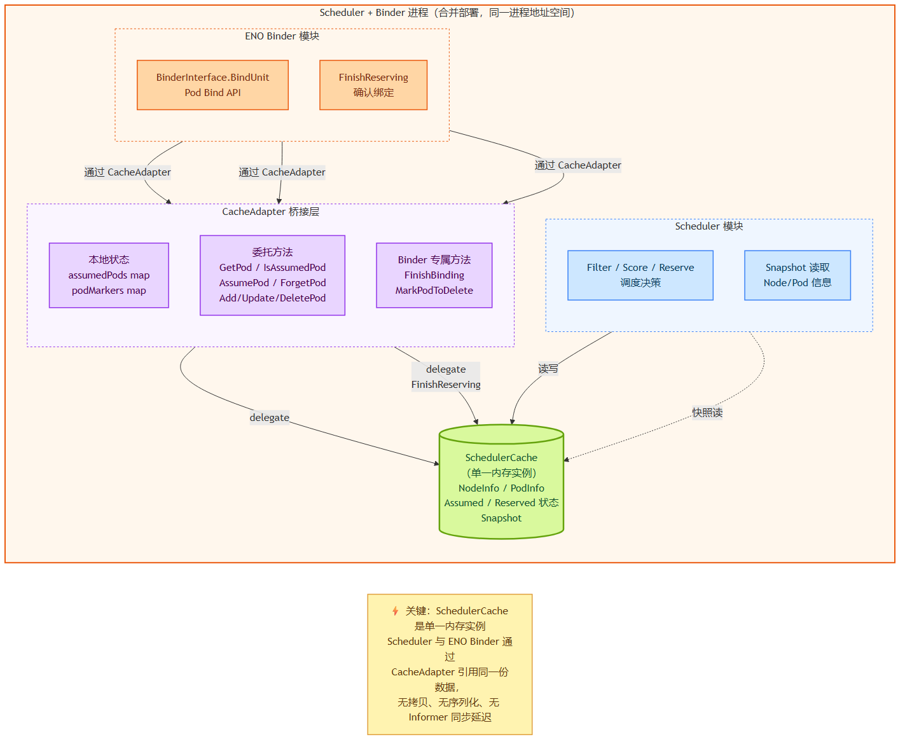
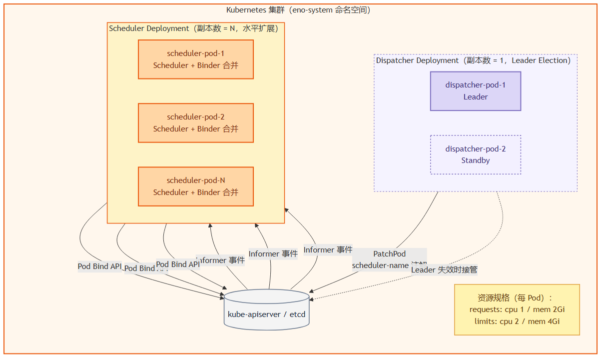

# 第五章 面向大规模场景的架构优化 —— ENO

第 3、4 章构建的分布式 Kubernetes 调度器架构在正确性与容错性上已经完备，但**性能仍然存在优化空间**。特别是原架构中独立部署的 Binder 组件，在超高并发场景下会重新成为整个调度流水线的瓶颈。本章提出 **ENO（Embedded Node Operator）**——将 Binder 合并进 Scheduler 进程的架构改造方案，通过 Cache 零拷贝共享、消除跨进程 API 调用、保持 CLI 开关可切换性等设计要点，在不牺牲一致性保证的前提下取得显著的性能提升。

## 5.1 独立 Binder 的性能开销分析

在原 Gödel 架构中，Binder 作为独立的 Deployment 部署，与 Scheduler 进程通过 Kubernetes API Server 间接通信。图 5-1a 展示了这一部署形态下 Pod 从被分发到最终绑定的完整跨进程流程。



**图 5-1a  独立 Binder（改造前）：5 步跨进程流程**

图 5-1a 中，标号 ① ~ ⑤ 表示 5 次 API Server 调用：

- **①** Dispatcher `PatchPod` 写入 `scheduler-name` 注解；
- **②** Informer 将该修改事件推送到 Scheduler 进程；
- **③** Scheduler 完成 Filter/Score/Reserve 后 `PatchPod` 写入 `assumed-node` 注解；
- **④** Informer 将该修改事件推送到独立的 Binder 进程；
- **⑤** Binder 通过 Bind API 完成最终绑定。

其中 **步骤 ④** 是本文特别关注的开销来源：Scheduler 与 Binder 之间没有直接连接，它们通过 API Server + etcd 中转事件，每次事件都涉及序列化（Pod 对象转 protobuf）、网络传输、反序列化、Informer 索引更新等一系列开销。在超高并发场景下，这一步的开销会在如下几个维度累积：

**（1）序列化 / 反序列化 CPU 开销**：每个 Pod 对象大小约 3~10 KB，包含 metadata、spec、status 等字段。以本文实验的 w3 负载（1000 pods/s）为例，稳态吞吐意味着 API Server + Informer 每秒完成 1000 次完整的 Pod 对象序列化/反序列化循环，累计消耗可观的 CPU 时间；

**（2）Informer 事件延迟**：从 API Server 的 Watch 推送到 Binder 的 Informer 处理完成，通常有数十到数百毫秒的端到端延迟（受批处理、限流、handler 排队影响）。这一延迟直接叠加到 Pod E2E 调度延迟上；

**（3）额外的 apiserver 往返**：④ 步骤是一次完整的 Watch 事件推送（虽然是 apiserver 主动推送，但仍占用 apiserver 的连接与 goroutine 资源）；相当于比"Scheduler 直接调用 Bind API"多了一整个 apiserver 交互周期；

**（4）独立 Binder 的资源占用**：独立 Binder 作为独立 Deployment 需要独立的 CPU / 内存配额、独立的健康探测、独立的日志与监控。在 3-5 副本水平扩展的 Scheduler 集群中，额外的 Binder Deployment 是明显的资源冗余。

## 5.2 ENO 架构：进程内 Binder 合并

### 5.2.1 设计目标

针对 §5.1 分析的四类开销，本文提出如下设计目标：

- **消除步骤 ④ 的跨进程事件传递**：由 Scheduler 进程内的 Binder 模块直接完成绑定，无需再次经过 apiserver 中转；
- **零拷贝共享 SchedulerCache**：Binder 与 Scheduler 共享同一份 SchedulerCache 内存实例，消除 Assumed 状态在两个进程间同步的开销；
- **保持一致性保证**：第 4 章描述的四层容错机制**在新架构下必须完整保留**，Layer 0 校验、Layer 1/2 重试、Layer 3 全局回退均不能因合并部署而丢失；
- **向后兼容**：新架构不应强制用户迁移，通过 CLI 开关 `--enable-embedded-binder` 可在两种部署形态之间自由切换。

### 5.2.2 ENO 架构总览

图 5-1b 展示了 ENO 架构下的进程边界。



**图 5-1b  ENO 进程内 Binder（改造后）：3 步进程内流程**

对比图 5-1a 与 5-1b 可见，ENO 架构下：

- Scheduler + Binder 合并为一个进程，副本数为 N；
- API Server 调用从 5 步减少为 3 步（① dispatching → ② Informer 事件 → ③ Bind API）；
- 步骤 ④（原图 5-1a 中的 Scheduler → Binder 事件传递）**完全消失**，因为 Scheduler 与 Binder 现在是同一进程内的两个模块，通过内存直接调用；
- 步骤 ⑤（原图 5-1a 中的 Bind API）现在由 Scheduler 进程内的 Binder 模块直接发起，即图 5-1b 中的步骤 ③。

## 5.3 CacheAdapter 与零拷贝共享

将 Binder 从独立进程移入 Scheduler 进程后，一个关键的技术挑战是**如何让 Binder 与 Scheduler 共享 SchedulerCache**。原架构中，两者位于不同进程，Binder 通过 Informer 独立维护自己的资源视图；合并后，若仍采用"Binder 有自己的资源视图"的做法，则内存中会存在两份互相同步的 SchedulerCache，同步延迟与内存开销都不可接受。

本文提出通过 **CacheAdapter 桥接层**实现零拷贝共享。图 5-2 展示了三方数据流。



**图 5-2  CacheAdapter 桥接层实现 SchedulerCache 零拷贝共享**

### 5.3.1 CacheAdapter 的职责

CacheAdapter 是本文设计的桥接层，位于 Scheduler 模块与 ENO Binder 模块之间。它对上层 ENO Binder 暴露出 Binder 熟悉的接口（例如原独立 Binder 使用的 `GetPod`、`IsAssumedPod`、`AssumePod`、`ForgetPod` 等），但内部实现全部**委托**给 Scheduler 已经维护的 SchedulerCache——不复制、不缓存、不同步。

图 5-2 中的三个子模块清晰划分了 CacheAdapter 的实现：

- **本地状态**：`assumedPods map`、`podMarkers map`。这些是**独属于 Binder 的额外元数据**，例如 Assumed 但尚未 Bind 的 Pod 集合、待清理的 Pod 标记。这些元数据的规模远小于 SchedulerCache 主体，独立维护开销可忽略；
- **委托方法**：`GetPod / IsAssumedPod / AssumePod / ForgetPod / Add/Update/DeletePod`。这些方法接收调用后直接转发给 SchedulerCache 的对应方法，无任何数据拷贝；
- **Binder 专属方法**：`FinishBinding`、`MarkPodToDelete` 等原 Binder 所特有的方法，一部分委托 SchedulerCache（例如 `FinishReserving`），一部分操作 CacheAdapter 自己的本地状态。

### 5.3.2 零拷贝的技术要点

零拷贝的关键在于：**Scheduler 模块与 ENO Binder 模块访问的是同一个 SchedulerCache Go 对象**（同一块内存地址）。具体实现要点：

- **对象共享而非拷贝**：Scheduler 与 CacheAdapter 都持有指向同一个 `*Cache` 结构体的指针；
- **并发安全**：SchedulerCache 内部通过 `sync.RWMutex` 保护，Scheduler 与 Binder 的并发访问安全；
- **无 Informer 同步延迟**：原架构中，Binder 需要通过独立的 Informer 观察 Pod 变更（有典型的数十毫秒延迟）；新架构中，Scheduler 一旦在 Reserve 阶段修改了 SchedulerCache，Binder 立即通过 CacheAdapter 看到最新状态，零延迟；
- **减少内存占用**：整个进程只维护一份 SchedulerCache（数十 MB 到数百 MB 级别，取决于集群规模），而不是 Scheduler + Binder 两份。

## 5.4 部署拓扑变化

图 5-3 展示了 ENO 架构下的 Kubernetes Deployment 视角。



**图 5-3  ENO 部署拓扑（Kubernetes Deployment 视角）**

如图 5-3 所示，ENO 架构下 `eno-system` 命名空间内的关键 Deployment 变为：

- **Dispatcher Deployment**：副本数 = 1（+1 Standby），通过 Leader Election 保证单实例活跃，负责节点分区管理与 Pod 分发；
- **Scheduler Deployment**：副本数 = N（水平扩展），每个 Pod 内部同时运行 Scheduler 模块 + ENO Binder 模块。

与原 Gödel 架构相比，**独立的 Binder Deployment 被彻底移除**。这一变化带来的运维层面收益包括：

- 减少一个需要维护的 Deployment（配置、镜像、健康探测、日志、监控都少一份）；
- Scheduler 的资源规格（每 Pod requests: 2 CPU / 4G MEM，limits: 4 CPU / 8G MEM）已经预留了 Binder 合并后的资源需求，无需在合并后调整；
- 水平扩展时只需扩展 Scheduler Deployment 副本数，无需同时协调 Binder 副本数——分布式调度器的水平扩展变得更为简单直接。

## 5.5 BinderInterface 抽象与向后兼容

为了在合并 Binder 的同时保持向后兼容，本文抽象了 `BinderInterface`。原独立 Binder 与新的进程内 Binder 都实现这一接口，调用方（Scheduler 的 `unit_scheduler`）无需感知底层部署形态。接口定义如下：

```go
// 摘自 pkg/binder/binder_interface.go
type BinderInterface interface {
    // BindUnit 对给定 BindRequest 中的所有 Pod 执行冲突检查与绑定。
    // 返回 BindResult 指示每个 Pod 的成功/失败情况。
    BindUnit(ctx context.Context, req *BindRequest) (*BindResult, error)

    // Start 启动 Binder 的内部工作协程，必须在 BindUnit 之前调用。
    Start(ctx context.Context) error

    // Stop 优雅关闭，等待 in-flight 绑定完成。
    Stop()
}
```

`BinderInterface` 的三个特点：

**（1）与部署形态解耦**：`BindUnit` 是唯一的调用入口，不论是独立 Binder 通过 gRPC 收到请求，还是进程内 Binder 直接被调用，接口签名一致。这使得 Scheduler 的调用代码在两种形态下完全一致。

**（2）以调度单位（Unit）为粒度**：一个 `BindRequest` 可以包含多个 Pod（例如 PodGroup 中的所有 Pod）。这一设计既支持单个 Pod 的简单场景，也支持 Gang 调度所需的多 Pod 整体绑定语义。

**（3）明确的失败语义**：`BindResult` 通过 `SuccessfulPods` 与 `FailedPods` 分别报告每个 Pod 的结果，调用方可细粒度处理部分失败情况——例如 Gang 调度失败时立即清理其他已成功的 Pod。

### 5.5.1 CLI 开关与运行时切换

在 [cmd/scheduler/app/options/options.go](cmd/scheduler/app/options/options.go) 中新增了 `--enable-embedded-binder` 布尔开关：

- **默认值 `false`**：保持与 Gödel 原架构完全一致，独立 Binder Deployment 承担绑定职责；
- **设为 `true`**：Scheduler 进程内启动 ENO Binder 模块，独立 Binder Deployment 可被删除（或保持运行但空转）。

这一 CLI 开关的设计遵循**运维视角的稳态切换**原则——生产环境可以先在小流量集群启用 ENO 验证效果，确认无异常后再扩大到全量集群，全程不需要修改 Scheduler 之外的任何组件。

## 5.6 一致性保证在 ENO 下的延续

第 4 章的四层容错机制在 ENO 架构下**完整保留**且**无需修改代码**：

- **Layer 0（节点归属校验）**：`NodeValidator` 只依赖 Node 的注解读取（通过 `NodeGetter` 抽象），与 Binder 是独立进程还是进程内模块无关。校验行为不变；
- **Layer 1（同步重试）**：`bindPodToNode` 的重试循环在进程内直接执行，反而**降低了重试延迟**（无需再经过 gRPC 或 apiserver 事件传递）；
- **Layer 2（异步 Reconciler）**：`APICallFailedTaskQueue` 与 Reconciler Worker 现在位于 Scheduler 进程内，`ForgetPod` 直接对共享的 SchedulerCache 调用，效果更直接；
- **Layer 3（跨实例回退）**：Layer 3 通过 `PatchPod` 清除 `scheduler-name` 注解触发 Dispatcher 重分发，此过程**完全独立于 Binder 部署形态**——注解操作对 apiserver 而言就是普通的 Patch。

因此 ENO 是一次**纯粹的性能优化**，其正确性完全建立在第 4 章的论证之上。这也是本文将 ENO 独立成第 5 章而非并入第 4 章的原因——ENO 与容错机制在概念上是解耦的两件事情。

## 5.7 本章小结

本章从 §5.1 独立 Binder 的四类开销分析出发，提出了将 Binder 合并进 Scheduler 进程的 ENO 架构（§5.2），并通过如下技术要点在保持一致性的前提下取得性能改进：

- **CacheAdapter 桥接层**（§5.3）：通过对象引用共享 SchedulerCache，实现零拷贝、零同步延迟；
- **部署拓扑简化**（§5.4）：独立 Binder Deployment 被移除，运维复杂度下降；
- **BinderInterface 抽象**（§5.5）：以调度单位为粒度的接口，屏蔽部署形态差异；
- **CLI 开关可切换性**（§5.5.1）：`--enable-embedded-binder=true/false` 支持在生产环境稳态切换，向后兼容；
- **一致性保证的自动继承**（§5.6）：第 4 章的四层容错机制在 ENO 下完整保留，无需修改。

ENO 的性能改进将在第 6 章通过 KWOK 仿真下的大规模基准测试进行定量评估。
