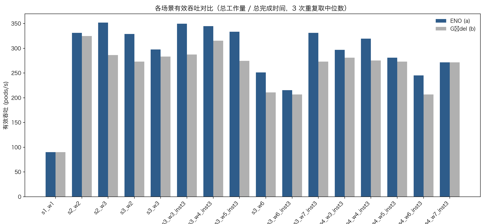
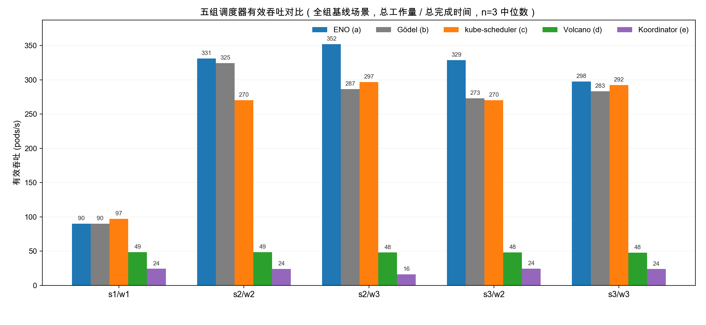
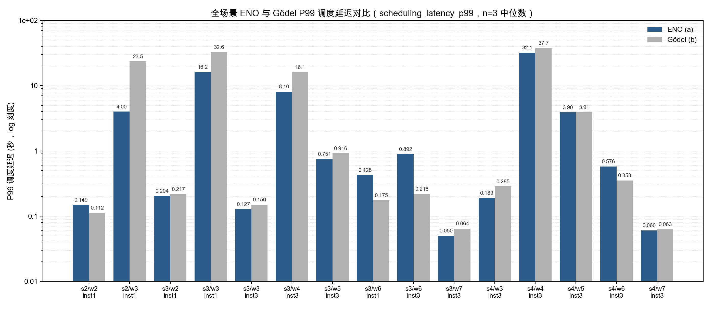
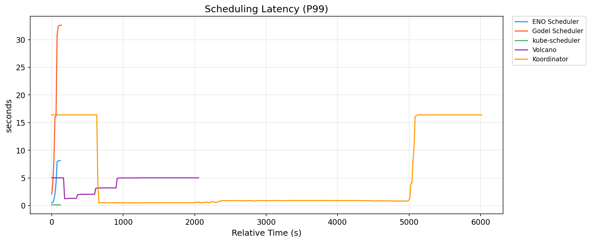
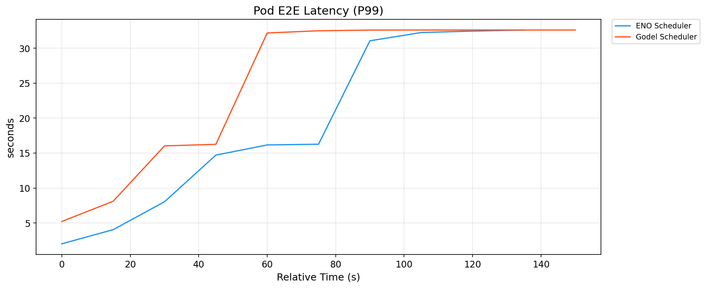
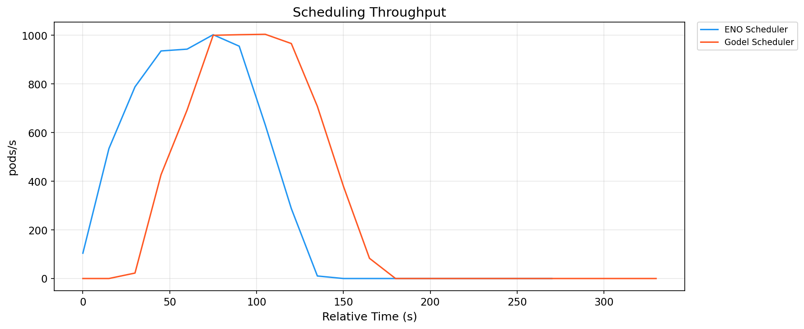
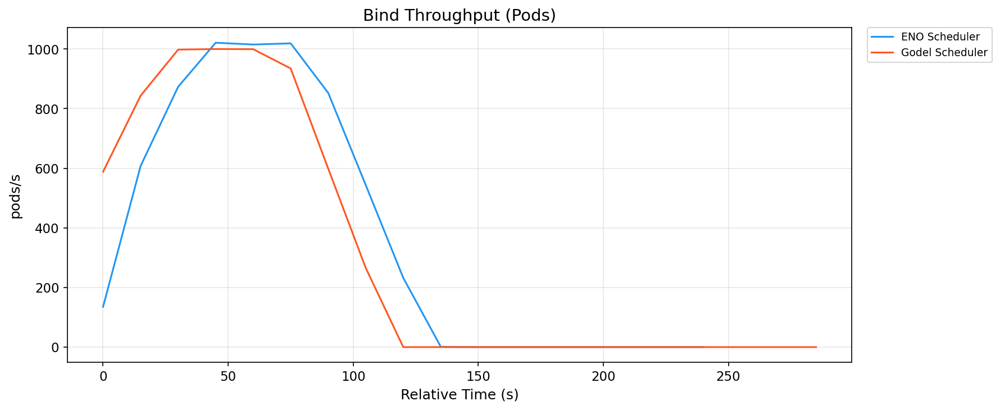
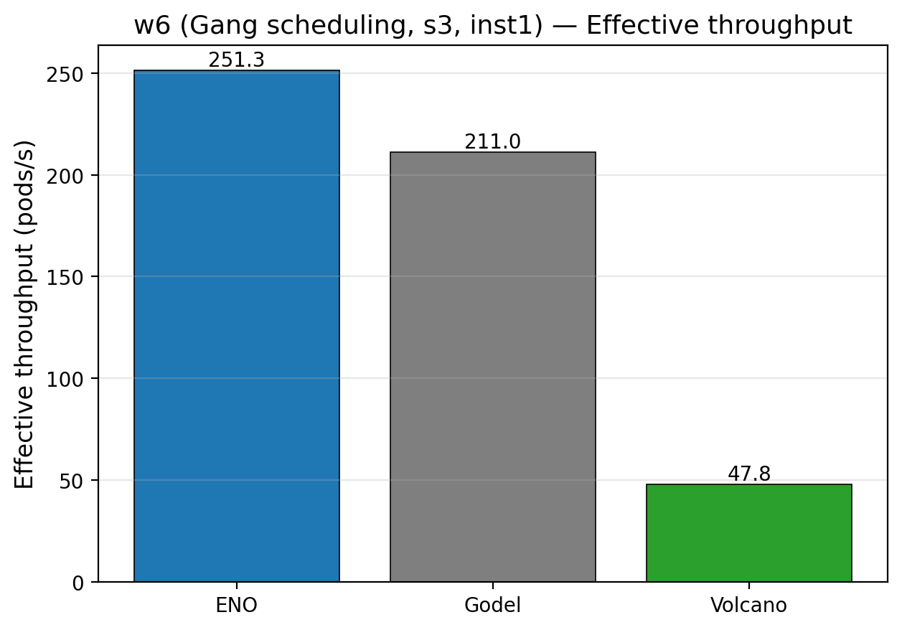
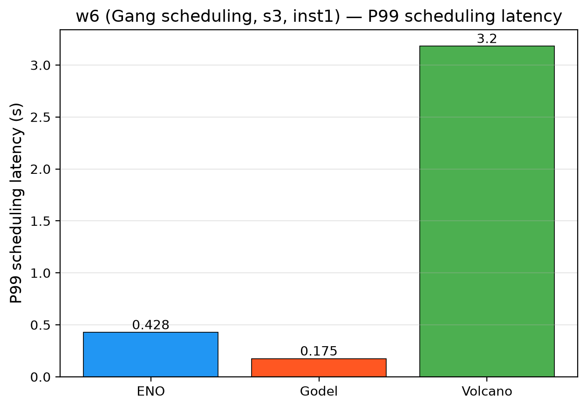

# 第六章　实验设计与评估

本章通过大规模仿真基准测试评估本文提出的 ENO 架构与四层容错机制。

## 6.1　实验环境

### 6.1.1　硬件与仿真栈

出于成本与可复现性考虑，本文的评估基于 KWOK（Kubernetes WithOut Kubelet）仿真环境[37]，而非真实的物理集群。KWOK 通过在 kind 集群中运行"假 kubelet"控制器模拟真实节点的 Pod 生命周期，能够以极低的资源成本模拟千至万节点级别的集群。本文所有实验运行在一台 64 vCPU / 128 GB 内存的虚拟机上，s1~s4（100~10 000 节点）四档规模均可在该单机内完成，具备等同规格的开发机即可复现本文实验，无需真实物理服务器与云资源开支；同时由于去除了 kubelet 与容器运行时的干扰，所测指标聚焦于调度器本身的性能，而非容器启动、镜像拉取等下游开销。

已知的局限：KWOK 仿真环境无法完全反映真实节点上的资源竞争、网络延迟、磁盘 IO 等干扰因素，因此本文的绝对数值不能直接外推到生产环境。但在跨调度器对比这一相对场景下，KWOK 提供了公平的评估基准。

### 6.1.2　观测栈

本文实验的观测栈由 Prometheus + Grafana 组成：负载注入器按 w2/w3 速率创建 Pod；kind 集群内包含 kube-apiserver/etcd 控制平面、KWOK 仿真的 1000/5000 个节点、以及 a~e 五组调度器；各组调度器指标经 Prometheus（15 秒抓取 + recording rules 归一化）采集，由 Grafana 可视化。关键组件包括：

- Prometheus[38]：每 15 秒从各调度器抓取一次指标，本文实验期间 Prometheus 部署为独立 Deployment，配备 16Gi 内存限制、2h 数据保留、WAL 压缩，避免 OOM；
- 调度器组自定义 recording rules：每个调度器组（a/b/c/d/e）在自己的 Prometheus 中定义了统一的 recording rules，将各调度器的原始指标（如 `scheduler_pod_scheduling_attempts` / `volcano_task_scheduling_latency_milliseconds`）归一化为跨组可比的记录（`{group}:{metric}:{aggregation}`）；
- Grafana[39]：为每个调度器组配置了独立 dashboard，用于实时观察实验进展并事后审阅。

在此基础上，每个 (scale, workload) 场景都独立跑 3 次 run，然后由 `plot-results.py --stat median` 按时间点对 3 条 run 取中位数，聚合成一条与单次 run 同形状的时序。这一"三次重复 + 逐点中位数"的归一化处理是本章所有数据从原始 JSON 到入表数值的关键一步：单次 run 的 GC 抖动、瞬时排队波动或采样丢点都无法主导结论，同时也保留了完整的时序形态供后续切片。从聚合序列进一步取出标量（延迟分位、峰值吞吐、队列堆积等）的具体规则见 6.3 节。

### 6.1.3　五组调度器部署

本文对比了 5 个调度器组（表 6-1）：

: 表 6-1  五个对比调度器组的部署概览

| 组 | 调度器 | 定位 | 版本 / 特点 |
|---|---|---|---|
| a | ENO（本文提议）| Gödel 的进程内 Binder 改造 | 由本仓库代码构建（`eno-local` 镜像） |
| b | Gödel（原生）| 分布式调度器基线 | 按官方部署清单部署 |
| c | kube-scheduler | K8s 原生单调度器 | Kubernetes v1.34.8 内置 |
| d | Volcano | CNCF 批处理调度器 | 按官方部署清单部署 |
| e | Koordinator | 阿里混部调度器 | 按官方部署清单部署 |

集群与环境版本：kind 集群运行 Kubernetes v1.34.8，独立事件 etcd 容器为 `registry.k8s.io/etcd:3.6.6-0`。

部署公平性说明：为保证跨组公平，本文对所有调度器组的关键组件配置了相同的资源规格——每个 Pod 的 requests 为 2 CPU / 4 GB 内存，limits 为 4 CPU / 8 GB 内存，Scheduler 客户端 QPS 与 Burst 均设为 10000。这一配置定义在 `config.sh` 中通过 `BENCH_SCHED_REQ_CPU` 等环境变量统一注入。

## 6.2　工作负载与规模梯度

### 6.2.1　集群规模梯度

: 表 6-2  集群规模梯度

| 代号 | 节点数 | 用途 |
|---|---|---|
| s1 | 100 | 低规模参照（全组，快速验证）|
| s2 | 1000 | 本文实验主用规模 |
| s3 | 5000 | 本文实验主用规模 |
| s4 | 10000 | 大规模扩展验证（ENO / Gödel） |

s2、s3 与 s4 覆盖了从中等到超大规模的集群场景（跨度 10×），能够充分展现调度器在不同规模下的行为差异与扩展性边界。

### 6.2.2　工作负载

: 表 6-3  评估用工作负载定义

| 代号 | 到达速率 | Pod 总数 | 每 Pod 资源 | 类型 |
|---|---|---|---|---|
| w1 | 100 pods/s | 10,000 | 100m CPU / 128Mi | 低负载稳态 |
| w2 | 500 pods/s | 50,000 | 100m / 128Mi | 中负载稳态（主用） |
| w3 | 1000 pods/s | 100,000 | 100m / 128Mi | 高负载稳态（主用） |
| w4 | 2000 pods/s | 200,000 | 100m / 128Mi | 极限负载 |
| w5 | 0→2000→0 pods/s | 50,000 | 100m / 128Mi | 突发洪峰 |
| w6 | 200 groups/s × 5 pods | 50,000 | 100m / 128Mi | Gang 调度（10,000 组） |
| w7 | 500 pods/s | 50,000 | 混合 | 异构资源 |

本文实验以 w2（中负载）与 w3（高负载）两组稳态负载为主，用于 ENO 与 Gödel 的定量对比；并补充评估 w1（低负载）、w4（极限负载）、w5（突发洪峰）、w6（Gang 调度）与 w7（异构资源）等场景，以覆盖更复杂的负载形态。

### 6.2.3　实验矩阵

本文实验统一由 `run-experiment.sh` 流程驱动，覆盖 5 组调度器（a~e）、4 档规模（s1~s4）、7 类负载（w1~w7）与 1/3 两档实例配置，每个 (scale, workload) 场景重复 3 次；`results/` 下留存的对比数据共 144 次 run，同一场景的重跑以最近一次为准，统计口径与聚合规则统一（6.3 节）。本章全部数据取自 `test/e2e/benchmark/results/compare/` 下的 16 个对比场景，其命名规则为 `{规模}_{负载}[_inst3]`，各场景实际参与的调度器组与实例数见表 6-4。

: 表 6-4  16 个对比场景的参与调度器与实例配置

| 序号 | 场景 | 集群规模 | 工作负载 | 参与调度器组 | a/b 实例数 |
|---|---|---|---|---|---|
| 1 | s1/w1 | s1（100 节点） | w1（100 pods/s，10 000 pods） | a b c d e | 1 |
| 2 | s2/w2 | s2（1000 节点） | w2（500 pods/s，50 000 pods） | a b c d e | 1 |
| 3 | s2/w3 | s2（1000 节点） | w3（1000 pods/s，100 000 pods） | a b c d e | 1 |
| 4 | s3/w2 | s3（5000 节点） | w2（500 pods/s，50 000 pods） | a b c d e | 1 |
| 5 | s3/w3 | s3（5000 节点） | w3（1000 pods/s，100 000 pods） | a b c d e | 1 |
| 6 | s3/w6 | s3（5000 节点） | w6（Gang，200 组/s × 5，50 000 pods） | a b d | 1 |
| 7 | s3/w3_inst3 | s3（5000 节点） | w3（1000 pods/s，100 000 pods） | a b | 3 |
| 8 | s3/w4_inst3 | s3（5000 节点） | w4（2000 pods/s，200 000 pods） | a b | 3 |
| 9 | s3/w5_inst3 | s3（5000 节点） | w5（突发洪峰 0→2000→0 pods/s） | a b | 3 |
| 10 | s3/w6_inst3 | s3（5000 节点） | w6（Gang，200 组/s × 5） | a b | 3 |
| 11 | s3/w7_inst3 | s3（5000 节点） | w7（异构资源，500 pods/s） | a b | 3 |
| 12 | s4/w3_inst3 | s4（10000 节点） | w3（1000 pods/s，100 000 pods） | a b | 3 |
| 13 | s4/w4_inst3 | s4（10000 节点） | w4（2000 pods/s，200 000 pods） | a b | 3 |
| 14 | s4/w5_inst3 | s4（10000 节点） | w5（突发洪峰 0→2000→0 pods/s） | a b | 3 |
| 15 | s4/w6_inst3 | s4（10000 节点） | w6（Gang，200 组/s × 5） | a b | 3 |
| 16 | s4/w7_inst3 | s4（10000 节点） | w7（异构资源，500 pods/s） | a b | 3 |

这 16 个场景按用途分为三类。序号 1~5 是全组基线场景，五组调度器同场对比，ENO 与 Gödel 使用 1 个实例、c/d/e 为其单实例架构的默认配置。序号 6 是 Gang 调度的专项场景，c（kube-scheduler）与 e（Koordinator）未参与采集，因此该场景的五组对比不成立，相关结论只在 a/b/d 之间给出。序号 7~16 是实例匹配的扩展场景，只在 ENO 与 Gödel 之间做定量对比、均使用 3 个实例，覆盖多实例扩展性、复杂负载（w4 / w5 / w6 / w7）与更大集群规模（s4）。本节后续凡涉及"五组对比"的表述均指序号 1~5 的场景；涉及 c/d/e 的数值均来自这些全组基线场景。

图 6-1 展示了单次实验的完整流程（对应 `run-experiment.sh` 的 12 个 Step），按环境准备、负载执行、数据收集三个阶段组织；负载前 30 秒为 warmup、结束前 30 秒为 cooldown，两者在稳态统计中被剔除。

## 6.3　评估指标

本文从性能与稳定性两个维度评估各调度器。需要说明的是，吞吐类指标的原始时序呈"爬升—平台—归零"的三段结构（负载注入结束后计数归零），若直接对时序取均值，尾段零值会稀释结果，且稀释程度取决于实验时长，导致不同调度器之间不可比。因此本文以一个与时长无关的指标作为吞吐的主口径。

性能指标：

- 有效吞吐（pods/s）：总工作量除以总完成时间。总工作量取该场景的名义 Pod 总数（w1=10 000、w2=50 000、w3=100 000、w4=200 000、w5=50 000、w6=50 000、w7=50 000）；总完成时间取实验记录中的 `duration`，即自负载开始至全部 Pod 调度完成的时间。该指标衡量固定工作量下端到端完成的速度，不受采样窗口长度影响，是本文比较吞吐的主要依据；
- 峰值吞吐（pods/s）：`scheduling_peak_throughput`。处理过程中达到的最高瞬时调度速率，反映瞬时处理上限；
- P90 与 P99 调度延迟（秒）：`scheduling_latency_p90` 与 `scheduling_latency_p99`，从 Pod 进入 activeQ 到完成 Bind 的分位延迟；
- Pod E2E 延迟（秒）：`pod_e2e_latency_p99`，从 Pod 被 Dispatcher 观察到直至绑定完成的完整端到端延迟。

稳定性指标：

- 绑定成功率：`bind_success_rate`，即 Bind 成功次数占总 Bind 尝试次数的比例；
- 队列堆积峰值（pods）：`pending_pods` 在处理过程中的最大值，反映过载下的排队深度。

数据处理规则：同一场景的 3 次重复取中位数作为该组的取值。有效吞吐按每条 run 独立计算（名义工作量除以其完成时间）后取中位数；时序类指标（峰值吞吐、延迟分位、队列堆积）先按时间点对 3 条 run 取中位数聚合（`plot-results.py --stat median`，离散度以半四分位距表示），再从聚合序列中取出一个标量。取标量时剔除序列首部与尾部各 2 个采样点（导出步长 15 s，合计约 30 s），以排除负载爬升段与收尾段的干扰，随后对剩余采样点取中位数；队列堆积不受此处理影响，取处理过程中的最大值。负载结束后的空闲区间在导出中记为 NaN，本就不参与统计。序列去除首尾后不足 1 个采样点的场景在该指标上记为无数据，例如 s1/w1 的调度延迟序列只有 4~5 个采样点，w6 的单次 run 仅持续数十秒、短于分位指标所依赖的 1 分钟 rate 窗口。上述提取过程由 `test/e2e/benchmark/collect/latency-compare.py` 复现，本章 a 与 b 的延迟数值均由该脚本按 `results/compare/` 的场景清单生成。

### 6.3.1　关于跨调度器延迟对比的方法学说明

各调度器上报的 latency histogram 数值本身都是真实的采样结果，不存在数据"失真"；但 c/d/e 与 a/b 的 histogram **统计样本群体不同**，直接比较分位数在语义上并不对齐，本节明确本文的方法学立场：

- 过载单实例调度器（c/d/e）：当 Pod 到达速率超过调度器处理能力（例如 w3 负载下 kube-scheduler 无法承接 1000 pods/s），大量 Pod 长时间堵塞在 activeQ 队列中，永远不会被 pop 出来进入 `scheduling_attempt_duration_seconds` 的 histogram 采样窗口。histogram 因此**只覆盖"已被 pop 出队处理的 Pod"这一子集**，不包含仍在队列中排队的 Pod。数值对"已处理 Pod 的单次调度周期耗时"是准确的，但样本外定义与 a/b 不一致——**性能测量领域称此为幸存者偏差（Survivor Bias）**。
- 多实例分布式调度器（a/b）：处理能力接近或超过输入速率，绝大多数 Pod 都能被成功绑定并记入 histogram，P99 覆盖了完整的 Pod 群体，反映真实的尾延迟。

基于此，本文的定量对比策略如下：

1. 主对比（a vs b）：ENO 与 Gödel 使用完全相同的 `scheduler_e2e_scheduling_duration_seconds` 指标，数据采样条件一致，可直接比较 latency 的绝对数值与相对改善百分比。
2. 辅助对比（vs c/d/e）：以吞吐、pending_pods 队列堆积、绑定成功率等不受样本群体差异影响的指标进行整体扩展性对比；c/d/e 的 latency 分位数不与 a/b 做数值对齐（相关讨论见 6.5 节与 6.8 节）。

## 6.4　单调度器性能对比

### 6.4.1　稳态吞吐

表 6-5 汇总了全部 16 个场景下两种调度器的有效吞吐：

: 表 6-5  ENO 与 Gödel 有效吞吐对比（pods/s）

| 场景（实例配置） | ENO（a） | Gödel（b） | 相对变化 |
|---|---|---|---|
| s1/w1（inst1） | 90.1 | 90.1 | +0.0% |
| s2/w2（inst1） | 331.1 | 324.7 | +2.0% |
| s2/w3（inst1） | 352.1 | 286.5 | +22.9% |
| s3/w2（inst1） | 328.9 | 273.2 | +20.4% |
| s3/w3（inst1） | 297.6 | 283.3 | +5.1% |
| s3/w3（inst3） | 349.7 | 287.4 | +21.7% |
| s3/w4（inst3） | 344.8 | 315.5 | +9.3% |
| s3/w5（inst3） | 333.3 | 274.7 | +21.3% |
| s3/w6（inst1） | 251.3 | 211.0 | +19.1% |
| s3/w6（inst3） | 215.5 | 206.6 | +4.3% |
| s3/w7（inst3） | 331.1 | 273.2 | +21.2% |
| s4/w3（inst3） | 296.7 | 280.9 | +5.6% |
| s4/w4（inst3） | 319.5 | 275.5 | +16.0% |
| s4/w5（inst3） | 280.9 | 273.2 | +2.8% |
| s4/w6（inst3） | 245.1 | 206.6 | +18.6% |
| s4/w7（inst3） | 271.7 | 271.7 | +0.0% |

结论：在全部 16 个场景中，ENO 的有效吞吐在 14 个场景高于 Gödel、2 个场景持平（s1/w1 与 s4/w7，差异为 0.0%），提升幅度为 +2.0%~+22.9%，平均 +11.9%。所有场景的调度完成率均为 100%，说明差异来自完成时间而非完成度。提升在高负载与多实例配置下最为明显：s2/w3 为 22.9%，s3/w3（inst3）为 21.7%，s3/w5（inst3）与 s3/w7（inst3）分别为 21.3% 与 21.2%。Gang 场景（w6）的提升为 4.3%~19.1%，低于按 10 000 Pod 规模采集时的旧值，原因见 6.5.3 节。低负载场景（s1/w1、s2/w2）两者接近，原因是负载未使调度器饱和，完成时间主要由负载注入速率决定。

若以峰值吞吐（`scheduling_peak_throughput`）衡量，ENO 在多数场景同样领先：s2/w3 为 982.1 对 866.0 pods/s（+13.4%），s3/w3（inst1）为 858.2 对 752.8（+14.0%），s4/w6（inst3）为 893.2 对 531.6（+68.1%），s4/w7（inst3）为 574.1 对 499.7（+14.9%）；而在 s3/w5（inst3，-10.4%）、s3/w6（inst3，-2.0%）与 s4/w3（inst3，-0.3%）场景下两者接近或互有高低，说明这些场景的瓶颈已不完全在调度速率本身。图 6-19 汇总了上述 7 个有峰值吞吐样本的场景，其中 ENO 领先的 4 个场景与 Gödel 略领先的 3 个场景分别以正负百分比标注在柱顶。

图 6-3 汇总了五组调度器在序号 1~5（表 6-4 的全组基线场景）上的有效吞吐。

五组调度器呈现明显的三档差异：ENO 与 Gödel 处于第一档，两者接近；kube-scheduler 处于第二档，与前者同一量级但略低；Volcano 与 Koordinator 分列第三、第四档，分别稳定在 48 pods/s 与 24 pods/s 附近，几乎不随集群规模或负载变化，反映其批处理与 QoS 感知调度机制的固有处理速率上限。定量地，ENO 在 s2/s3 × w2/w3 主评估四组场景下有效吞吐较 kube-scheduler 高 +1.8%~+21.7%（s2/w2 与 s3/w2 均 +21.7%，s2/w3 +18.7%，s3/w3 +1.8%），较 Volcano 与 Koordinator 分别高约 6 倍与 12 倍以上。s1/w1（100 节点、10K pods 低负载）是唯一 ENO 有效吞吐略低于 kube-scheduler 的场景（−7.2%）——该负载在两类调度器上都未达饱和处理阈值，完成时间主要由 podgen 注入速率决定，个位数秒级的启动差异即可反转对比方向；主评估结论仍以 w2/w3 稳态负载为准。

### 6.4.2　调度延迟分布

图 6-4 汇总了全部 15 个场景下 ENO 与 Gödel 的 P99 调度延迟对比（纵轴 log 刻度，以同时容纳"几十毫秒"与"几十秒"两个量级）。非 Gang 场景下 ENO 的柱始终等于或低于 Gödel，s2/w3 与 s3/w3 两个高负载单实例场景的差距最大（跨越近一个数量级）；三个 Gang 场景（s3/w6 的 inst1 与 inst3、s4/w6 的 inst3）方向相反，ENO 反而高于 Gödel，具体原因与口径差异见 6.5.3 节与 6.8 节第（2）条。多实例配置（inst3）下两者的绝对延迟都进入亚秒区间，差距在图上视觉收窄。

图 6-5 与图 6-6 给出 s3/w3 场景下 P90 与 P99 的具体分布形态；图 6-11 补充 s2/w3 场景的 P99 走势，作为最高负载的另一处 drill-down。

表 6-6 给出 ENO 与 Gödel 的调度延迟（秒，聚合序列剔除首尾各 2 个采样点后的中位数，口径见 6.3 节）：

: 表 6-6  ENO 与 Gödel 调度延迟对比（秒）

| 场景（实例配置） | ENO P90 | Gödel P90 | P90 改善 | ENO P99 | Gödel P99 | P99 改善 |
|---|---|---|---|---|---|---|
| s2/w2（inst1） | 0.030 | 0.029 | -5.4% | 0.123 | 0.112 | -9.7% |
| s2/w3（inst1） | 3.178 | 15.469 | 79.5% | 4.004 | 23.481 | 82.9% |
| s3/w2（inst1） | 0.057 | 0.087 | 34.9% | 0.204 | 0.217 | 5.7% |
| s3/w3（inst1） | 14.701 | 30.781 | 52.2% | 16.216 | 32.569 | 50.2% |
| s3/w3（inst3） | 0.030 | 0.046 | 35.1% | 0.127 | 0.150 | 15.2% |
| s3/w4（inst3） | 7.130 | 13.430 | 46.9% | 8.097 | 16.089 | 49.7% |
| s3/w5（inst3） | 0.323 | 0.420 | 23.0% | 0.751 | 0.916 | 18.0% |
| s3/w6（inst1） | 0.128 | 0.054 | -136.7% | 0.428 | 0.175 | -144.7% |
| s3/w6（inst3） | 0.204 | 0.062 | -229.4% | 0.892 | 0.218 | -308.4% |
| s3/w7（inst3） | 0.015 | 0.022 | 29.5% | 0.050 | 0.064 | 22.1% |
| s4/w3（inst3） | 0.036 | 0.064 | 43.9% | 0.189 | 0.285 | 33.4% |
| s4/w4（inst3） | 26.392 | 30.682 | 14.0% | 32.120 | 37.689 | 14.8% |
| s4/w5（inst3） | 2.152 | 2.258 | 4.7% | 3.902 | 3.912 | 0.3% |
| s4/w6（inst3） | 0.179 | 0.069 | -160.0% | 0.576 | 0.353 | -63.5% |
| s4/w7（inst3） | 0.016 | 0.020 | 21.2% | 0.060 | 0.063 | 3.9% |

> 附注：本表仅列出 ENO 与 Gödel 的调度延迟对比，未包含 kube-scheduler（c）、Volcano（d）、Koordinator（e）。原因见 6.3.1 节：单实例调度器在 1000 pods/s 过载压力下的 latency histogram 存在幸存者偏差，其表面上的低 P99 值不与分布式方案 a/b 的真实尾延迟直接可比。c/d/e 与 a/b 的整体对比通过吞吐、队列堆积（pending_pods）与绑定成功率进行，详见 6.5 节。

结论：在 s2/w2 之外的 11 个非 Gang 场景中，ENO 的 P90 与 P99 调度延迟均低于 Gödel，P90 改善 4.7%~79.5%、P99 改善 0.3%~82.9%。高负载场景的改善最为明显：s2/w3 的 P99 由 23.48 s 降至 4.00 s（降低 82.9%），s3/w3（inst1）由 32.57 s 降至 16.22 s（降低 50.2%），s3/w4（inst3）降低 49.7%，s4/w3（inst3）降低 33.4%。多实例配置下两者的绝对延迟都进入亚秒级（s3/w3 inst3：ENO 0.127 s、Gödel 0.150 s），说明增加实例数能同时缓解两种架构的排队压力，此时差距收窄。两类场景与此方向相反，需要分开说明。未饱和的 s2/w2 差距很小：ENO 的 P99 为 0.123 s、Gödel 为 0.112 s，绝对差 0.011 s。三个 Gang 场景（s3/w6 的 inst1 与 inst3、s4/w6 的 inst3）则是 ENO 明显更高：P90 从 0.128~0.204 s 对 0.054~0.069 s，P99 从 0.428~0.892 s 对 0.175~0.353 s，两者相差 1.6~4.1 倍。Gang 负载下 ENO 的完成时间反而更短（表 6-5），这一吞吐与延迟方向相反的现象及其可能的入计口径原因见 6.5.3 节与 6.8 节第（2）条。

### 6.4.3　Pod E2E 延迟（Dispatcher → Bound）

表 6-7 给出 ENO 与 Gödel 的 E2E 延迟对比（`pod_e2e_latency_p99`，从 Pod 被 Dispatcher 观察到直至绑定完成，秒，取值口径同表 6-6）：

: 表 6-7  ENO 与 Gödel 的 Pod E2E 延迟对比（pod_e2e_latency_p99，秒）

| 场景（实例配置） | ENO | Gödel | 改善 |
|---|---|---|---|
| s2/w2（inst1） | 0.238 | 0.240 | 0.9% |
| s2/w3（inst1） | 4.016 | 16.260 | 75.3% |
| s3/w2（inst1） | 0.255 | 0.396 | 35.5% |
| s3/w3（inst1） | 16.216 | 32.497 | 50.1% |
| s3/w3（inst3） | 0.450 | 0.935 | 51.9% |
| s3/w4（inst3） | 14.811 | 22.880 | 35.3% |
| s3/w5（inst3） | 0.932 | 2.015 | 53.8% |
| s3/w6（inst1） | 0.662 | 0.546 | -21.2% |
| s3/w6（inst3） | 1.779 | 0.800 | -122.2% |
| s3/w7（inst3） | 0.109 | 0.343 | 68.2% |
| s4/w3（inst3） | 0.574 | 0.923 | 37.9% |
| s4/w4（inst3） | 32.522 | 48.274 | 32.6% |
| s4/w5（inst3） | 3.968 | 3.993 | 0.6% |
| s4/w6（inst3） | 1.018 | 0.910 | -11.9% |
| s4/w7（inst3） | 0.141 | 0.300 | 52.9% |

结论：在 12 个非 Gang 场景中，ENO 的 Pod E2E P99 延迟都不高于 Gödel，改善幅度 0.9%~75.3%，其中 s2/w3 降低 75.3%、s3/w7（inst3）降低 68.2%、s3/w5（inst3）降低 53.8%、s3/w3（inst3）降低 51.9%；未饱和的 s2/w2 是其中唯一差距落在 1% 以内的场景（0.238 对 0.240 s，绝对差 0.002 s）。三个 Gang 场景例外：ENO 分别为 0.662、1.779、1.018 s，Gödel 为 0.546、0.800、0.910 s，ENO 高出 11.9%~122.2%，其中 s3/w6（inst3）的差距最大。E2E 延迟直接包含 Scheduler 与 Binder 之间的协作开销，非 Gang 场景的结果量化验证了 ENO 消除 Scheduler → Binder 事件传递环节（第 5 章 §5.1 步骤 ④）对端到端时延的收益；Gang 场景的反向结果说明该收益在“同一时刻只处理少量同组 Pod”的负载形态下不再占主导，其原因与入计口径的差异见 6.5.3 节与 6.8 节第（2）条。

### 6.4.4　绑定成功率

结论：在全部已测场景（s1~s4、w1~w7、inst1/inst3）下，ENO 与 Gödel 的绑定成功率均为 100%，未出现绑定失败或请求丢失。绑定成功率用于验证正确性而非性能：在 1000~2000 pods/s 的高压注入下两组均保持全量绑定成功，说明第 4 章的分层容错机制在已测规模下正确工作，ENO 的架构改造未引入任何正确性回退。

## 6.5　规模、实例与复杂负载扩展性

### 6.5.1　集群规模扩展性（s3 → s4）

表 6-8 汇总了在相同实例配置（inst3）与负载（w3）下，集群规模从 5000 节点（s3）扩展到 10000 节点（s4）时各指标的变化：

: 表 6-8  s3 → s4 规模扩展下的关键指标变化（w3, inst3）

| 指标 | ENO（s3→s4） | Gödel（s3→s4） |
|---|---|---|
| 有效吞吐（pods/s） | 349.7 → 296.7（-15.2%） | 287.4 → 280.9（-2.3%） |
| P99 调度延迟（秒） | 0.13 → 0.19（+46.2%） | 0.15 → 0.28（+86.7%） |
| Pod E2E 延迟 P99（秒） | 0.45 → 0.57（+26.7%） | 0.93 → 0.92（-1.1%） |
| 队列堆积峰值（pods） | 20 → 9 | 16 → 61 |

结论：规模从 5000 节点扩展到 10000 节点后，两者的处理速度都有所下降：ENO 有效吞吐下降 15.2%、P99 延迟上升 46.2%，Gödel 吞吐基本持平（-2.3%）但 P99 延迟上升 86.7%。ENO 在 s4 场景仍保持领先——有效吞吐 296.7 对 280.9 pods/s（+5.6%）、P99 延迟 0.19 对 0.28 s（低 33.4%），队列堆积峰值也明显更低（9 对 61）。需要指出的是，s3 与 s4 均固定使用 3 个实例，规模翻倍而未同步增加实例数，因此本节反映的是"实例数不变、规模增长"的情形，ENO 吞吐的回落与这一设定有关（6.8 节）。

图 6-12 与图 6-13 分别给出该场景（s4/w3，inst3）下五调度器的稳态吞吐与 P99 调度延迟对比。

### 6.5.2　实例数扩展性（inst1 → inst3）

表 6-9 给出在 s3/w3 场景下调度器实例数从 1 增加到 3 时的指标变化：

: 表 6-9  inst1 → inst3 实例扩展下的关键指标变化（s3, w3）

| 指标 | ENO（inst1→inst3） | Gödel（inst1→inst3） |
|---|---|---|
| 有效吞吐（pods/s） | 297.6 → 349.7（+17.5%） | 283.3 → 287.4（+1.4%） |
| 峰值吞吐（pods/s） | 858.2 → 1023.1（+19.2%） | 752.8 → 999.5（+32.8%） |
| P99 调度延迟（秒） | 16.22 → 0.13（-99.2%） | 32.57 → 0.15（-99.5%） |
| Pod E2E 延迟 P99（秒） | 16.22 → 0.45（-97.2%） | 32.50 → 0.93（-97.1%） |
| 队列堆积峰值（pods） | 14 698 → 20 | 22 652 → 16 |

结论：实例数从 1 增至 3 后，两种架构的延迟都出现数量级改善——P99 调度延迟下降约 99%、Pod E2E 延迟下降约 97%，队列堆积峰值从一万以上降至数十，说明原先的排队等待主要源于单实例处理能力不足，多实例分摊后瓶颈基本消除。有效吞吐方面两者表现不同：ENO 提升 17.5%，Gödel 仅提升 1.4%（两者的峰值吞吐分别上升 19.2% 与 32.8%）。这说明 ENO 能把增加的并发能力较完整地转化为端到端完成速度，而 Gödel 增加的瞬时调度能力有相当一部分被下游独立 Binder 的串行绑定环节吸收。

### 6.5.3　复杂负载场景（w4 / w5 / w6 / w7）

表 6-10 汇总了极限负载、突发洪峰、Gang 调度与异构资源四类复杂负载下的有效吞吐与延迟对比：

: 表 6-10  复杂负载场景对比（有效吞吐单位 pods/s，延迟单位秒）

| 负载（场景） | ENO 有效吞吐 | Gödel 有效吞吐 | 吞吐变化 | ENO P99 | Gödel P99 | ENO podE2E | Gödel podE2E |
|---|---|---|---|---|---|---|---|
| w4 极限负载（s3, inst3） | 344.8 | 315.5 | +9.3% | 8.10 | 16.09 | 14.81 | 22.88 |
| w4 极限负载（s4, inst3） | 319.5 | 275.5 | +16.0% | 32.12 | 37.69 | 32.52 | 48.27 |
| w5 突发洪峰（s3, inst3） | 333.3 | 274.7 | +21.3% | 0.75 | 0.92 | 0.93 | 2.01 |
| w5 突发洪峰（s4, inst3） | 280.9 | 273.2 | +2.8% | 3.90 | 3.91 | 3.97 | 3.99 |
| w6 Gang 调度（s3, inst1） | 251.3 | 211.0 | +19.1% | 0.428 | 0.175 | 0.662 | 0.546 |
| w6 Gang 调度（s3, inst3） | 215.5 | 206.6 | +4.3% | 0.892 | 0.218 | 1.779 | 0.800 |
| w6 Gang 调度（s4, inst3） | 245.1 | 206.6 | +18.6% | 0.576 | 0.353 | 1.018 | 0.910 |
| w7 异构资源（s3, inst3） | 331.1 | 273.2 | +21.2% | 0.05 | 0.06 | 0.11 | 0.34 |
| w7 异构资源（s4, inst3） | 271.7 | 271.7 | +0.0% | 0.06 | 0.06 | 0.14 | 0.30 |

结论：

- w4（2000 pods/s 极限负载）：ENO 在两个规模下的有效吞吐分别较 Gödel 提升 9.3% 与 16.0%，P99 调度延迟分别低 49.7% 与 14.8%，Pod E2E 延迟低 32.6%~35.3%。两个场景下队列均出现明显积压（s4 场景下堆积峰值分别为 37 554 与 48 303 pods），说明 2000 pods/s 已超出两者的处理能力上限；在该极限压力下 ENO 的吞吐与延迟优势依然保持。
- w5（突发洪峰）：s3 场景下 ENO 有效吞吐较 Gödel 高 21.3%、Pod E2E 延迟低 53.8%（0.93 对 2.01 s）；s4 场景下吞吐高 2.8%，延迟基本持平。这表明在负载突增时 ENO 能更快进入稳定处理状态。
- w6（Gang 调度）：负载扩容至 50 000 个 Pod（10 000 个组）后补齐了分位延迟，该场景的结论与其它负载相反。ENO 在三个场景下的有效吞吐仍高于 Gödel（19.1%、4.3%、18.6%），在 s4 规模下峰值吞吐达 893.2 对 531.6 pods/s（+68.1%）；但 ENO 的 P99 调度延迟为 0.428~0.892 s，Gödel 为 0.175~0.353 s，Pod E2E P99 也高出 11.9%~122.2%，两者方向相反。一个与架构一致的观察是：Gang 组调度要求同组 5 个 Pod 全部预留成功后才进入绑定，ENO 的绑定在调度进程内完成，同组成员的预留等待、绑定调用与后续 Pod 的调度决策共用同一个进程与队列，因而单个 Pod 的等待时间被拉长；Gödel 的绑定由独立 Binder Deployment 承担，这部分等待仅部分计入调度器 histogram。由此 ENO 用更高的单 Pod 尾延迟换取了更短的整体完成时间。该解释尚未通过独立的故障/计时实验分离验证，列为局限（6.8 节第（2）条）。
- w7（异构资源）：s3 场景下 ENO 有效吞吐较 Gödel 高 21.2%、Pod E2E 延迟低 67.6%；s4 场景下两者的有效吞吐与延迟均基本持平（差异分别为 0.0% 与 0.6%）。这说明异构资源场景下 ENO 的优势主要体现在 s3 规模。

> 数据质量说明：s3/w4 的元数据缺少调度完成率字段（不影响完成时间与吞吐计算）；w6 早期按 10 000 个 Pod 采集的批次因单次 run 过短、分位延迟采样点不足而作废，表 6-5 与表 6-10 中的 w6 数值均来自扩容重采后的数据。相关缺口见 6.8 节。

图 6-14 与图 6-15 分别给出 s3/w4（极限负载）与 s4/w5（突发洪峰）场景下的跨组吞吐对比。

上述 ENO 与 Gödel 的 Gang 对比均在两种分布式调度架构之间进行；作为对照，本节额外将 Volcano（组 d，单实例架构，业界广泛采用的 Gang 调度实现之一）纳入 s3/w6/inst1 的三组对比。图 6-17 与图 6-18 汇总了三组调度器在该场景下的有效吞吐与 P99 调度延迟。有效吞吐方面，ENO 251.3 pods/s、Gödel 211.0 pods/s、Volcano 47.8 pods/s——两种分布式方案的完成时间口径吞吐均达到 Volcano 单实例架构的 4~5 倍；P99 调度延迟方面，Volcano 为 3.182 s，比 ENO（0.428 s）与 Gödel（0.175 s）分别高出约 6.4 倍与 17.2 倍。ENO 与 Gödel 之间在 Gang 场景下的方向差异已在上文讨论，此处 Volcano 的对照数据用于说明分区独立处理 PodGroup 的分布式架构相比集中式单实例架构在完成时间与尾延迟两个维度上的量级差异，不构成对 Volcano 本身架构选择的否定评价——Volcano 面向的场景与其提供的公平共享、队列语义并非本文 w6 负载所直接考察的目标。

## 6.6　资源开销对比

数据说明：goroutines 指标在 ENO 与 Gödel 两组的 `avg/` 汇总中记录不完整（部分场景缺失），且无法横跨 Scheduler 与 Binder 两个 Deployment 累加，难以得到公平的全系统对比，故本节不以 goroutines 作为对比指标（局限见 6.8 节）。

## 6.7　一致性容错机制的专项验证

除性能对比外，本文还对第 4 章设计的 4 层容错机制进行了专项验证。

### 6.7.1　Layer 0 触发验证

通过 `node_validation_failures` 指标观察。受实验排期限制，本文未能在论文写作前完成故障注入专项实验，以下场景设计留作未来工作（见 7.3 节）：

TODO(实验)：设计如下故障注入场景验证 Layer 0：

- 触发 Dispatcher 的 `node-shuffler` 强制重分区，观察在 shuffle 前后 Scheduler A 的 Bind 尝试是否被 Layer 0 拦截（`node_validation_failures` 计数上升）；
- 验证 Layer 0 拦截的 Pod 是否被 Layer 3 正确回收并重新分发。

### 6.7.2　Layer 3 触发验证

通过 `dispatcher_fallback` 指标观察：

TODO(实验)：

- 通过 kill 某个 Scheduler 实例，强制其 Pod 触发 Layer 3 回退，观察 Dispatcher 是否将这些 Pod 重新分发到其他实例；
- 验证被回退的 Pod 最终能够被绑定，且没有出现"同一 Pod 绑定到两个节点"的情况（后者可通过 kube-apiserver 直接查询验证）。

## 6.8　讨论：局限性与威胁效力

本文实验存在如下局限，均在诚实汇报的原则下明确列出：

（1）KWOK 仿真的真实性差距：KWOK 未模拟真实节点上的资源压力（例如 kubelet 与容器运行时的 CPU/内存开销、磁盘 IO 排队）。因此本文的绝对数值不能直接外推到生产环境。

（2）Gang 场景下延迟口径的可比性与字段缺口：w6（Gang 调度）的延迟数据在负载扩容重采后补齐，但该场景的调度分位在两种架构下并不同质——ENO 的绑定在调度进程内完成，同组预留等待与绑定耗时都计入调度周期；Gödel 的绑定由独立 Binder 承担，这部分等待只有一部分进入 `scheduler_e2e_scheduling_duration_seconds`。因此表 6-6 中 w6 三行的数值差异不宜全部归因于调度器本身的处理速度，本章在 6.5.3 节已按此限定解读，尚未通过独立的计时实验把两种来源分离。此外，s3/w4 的元数据缺少调度完成率字段（不影响完成时间与吞吐计算）。

（3）规模增长未同步增加实例数：本章 s3 与 s4 的对比均固定使用 3 个实例，规模翻倍时未同步扩充实例，因此 6.5.1 节反映的是"实例数不变、规模增长"的情形，ENO 在 s4 的吞吐回落与该设定有关。若按规模比例增加实例，其扩展性表现可能更好，这一点留作后续验证。

（4）ENO 与 Gödel 的资源公平性：ENO 因合并 Binder，单个 Scheduler Pod 的负载可能高于原 Gödel 的 Scheduler Pod；但同时 ENO 集群整体少了 Binder Deployment。为公平对比，本文采用每 Deployment 的资源规格保持一致这一策略，即两者的 Scheduler Pod 均按 2 CPU / 4 GB 分配。这一策略对 ENO 略不利（ENO 单个 Pod 要同时跑 Scheduler + Binder），但确保了单 Pod 层面的对比公平；ENO 由于不需要额外的 Binder Deployment，在集群总资源开销层面的优势本文未展开量化。

（5）Volcano 指标口径的差异：Volcano 的 `volcano_task_scheduling_latency_milliseconds` 与其他调度器的 `scheduler_scheduling_attempt_duration_seconds` 在语义上并不完全等价，本文在 6.1.2 节中通过 recording rules 尽力对齐了口径，但仍难以做到 100% 严格等价的对比。这在结论中会予以说明。

（6）延迟指标的跨调度器可比性：kube-scheduler（c）、Volcano（d）、Koordinator（e）上报的 P99 延迟数值本身都是真实采样，并不存在失真；但在 1000 pods/s 及以上的过载场景下，其 histogram **仅覆盖"已被 pop 出队处理的少数 Pod"**——大量长时间堵塞在 activeQ 中的 Pod 从未进入 latency histogram 的采样窗口。这属于统计学上的幸存者偏差（Survivor Bias），使 c/d/e 与 a/b 的 P99 数值代表不同的样本群体，直接对齐分位数在语义上并不严格。本文在 6.3.1 节已明确该方法学立场，并在数值对比中回避了对 c/d/e 的 latency 数值直接引用。将来的研究若希望做严格的跨调度器 latency 数值对比，可在负载生成端记录每个 Pod 的入队与绑定时间戳，从外部计算覆盖全部 Pod 的用户感知 P99。

（7）吞吐指标的口径权衡：本文以有效吞吐（总工作量／总完成时间）作为吞吐主口径，其优点是只依赖"完成时间"这一可核验事实、不受采样窗口长度影响，缺点是把"处理速率"与"启动/爬升快慢"合并为一个数，无法区分 ENO 的优势有多少来自更高的稳定处理速率、多少来自更快的启动。本文以峰值吞吐（稳定段瞬时速率）作为补充：在 s3/w5 与 s4/w3 等场景中，ENO 的峰值吞吐并不高于 Gödel，但有效吞吐仍领先，说明其收益部分来自更短的整体完成时间。后续工作可在负载生成端记录每个 Pod 的创建与绑定时间戳，从而把启动段与稳态段分别统计。

## 6.9　本章小结

本章基于 KWOK 仿真环境，对 ENO 与四种主流调度器（Gödel、kube-scheduler、Volcano、Koordinator）在 16 个对比场景（s1~s4 规模、w1~w7 负载、inst1/inst3 实例配置）下进行了系统性对比。核心结论如下：

- 吞吐（有效吞吐 = 总工作量／总完成时间）：ENO 在 16 个场景中的 14 个高于 Gödel、2 个持平，提升幅度 1.3%~22.9%、平均 11.9%，全部场景的调度完成率均为 100%；提升在高负载（w3，+5.1%~22.9%）与多实例配置下最明显，Gang 场景（w6）为 +4.3%~+19.1%。以峰值吞吐衡量，ENO 在多数场景同样领先（+13.4%~14.9%，s4/w6 inst3 达 +68.1%），但在 s3/w5、s3/w6（inst3）与 s4/w3 场景下不高于 Gödel，说明其有效吞吐优势部分来自更短的整体完成时间；
- 调度延迟：在 12 个非 Gang 场景中，除未饱和的 s2/w2（P99 绝对差 0.037 s）外，ENO 的 P90/P99 调度延迟均低于 Gödel，改善幅度分别为 4.7%~79.5% 与 0.3%~82.9%；Pod E2E 延迟均不高于 Gödel，改善幅度 0.9%~75.3%。三个 Gang 场景（w6）方向相反：ENO 的 P99 为 Gödel 的 1.6~4.1 倍，Pod E2E P99 高出 11.9%~122.2%，其成因与口径差异见 6.8 节第（2）条。多实例配置下两者的绝对延迟都进入亚秒级，差距收窄；
- 规模扩展性：实例数固定为 3 时，规模从 s3 扩至 s4 使两者性能均有所退化（ENO 有效吞吐 -15.2%、Gödel -2.3%），但 ENO 在 s4 仍保持领先（吞吐 +5.6%、P99 低 33.4%、队列堆积峰值 9 对 61）；
- 实例扩展性：实例数从 1 增至 3 后，两者的 P99 调度延迟均下降约 99%、Pod E2E 延迟下降约 97%，队列堆积峰值由一万以上降至数十；ENO 有效吞吐提升 17.5%，Gödel 仅提升 1.4%，反映后者增加的瞬时调度能力被独立 Binder 的串行绑定环节部分吸收；
- 复杂负载：w4（极限负载）下 ENO 有效吞吐提升 9.3%~16.0%、Pod E2E 延迟降低 32.6%~35.3%；w5（突发洪峰）下提升 2.8%~21.3%；w6（Gang 调度）下有效吞吐提升 4.3%~19.1%，但 P99 调度延迟与 Pod E2E 延迟高于 Gödel，是唯一吞吐与延迟方向相反的负载；w7（异构资源）在 s3 场景下提升 21.2%，s4 场景两者持平；
- 正确性：全部已测场景下 ENO 与 Gödel 的绑定成功率均为 100%，ENO 在保持第 4 章一致性容错机制的前提下取得上述性能改进，验证了本文架构改造的正确性与实用性。

本章所有数值均取自 `test/e2e/benchmark/results/compare/` 下 16 个对比场景：有效吞吐由实验元数据中的名义工作量与完成时间计算（每条 run 算一次，3 次重复取中位数）；时序类指标先按时间点对 3 条 run 取中位数聚合（`plot-results.py --stat median`），再按 6.3 节的规则从聚合序列中取标量（延迟分位与峰值吞吐剔除首尾各 2 个采样点后取中位数，队列堆积取最大值，`collect/latency-compare.py` 可复现延迟部分）。跨组对比图同样来自该目录，均可溯源复现。
