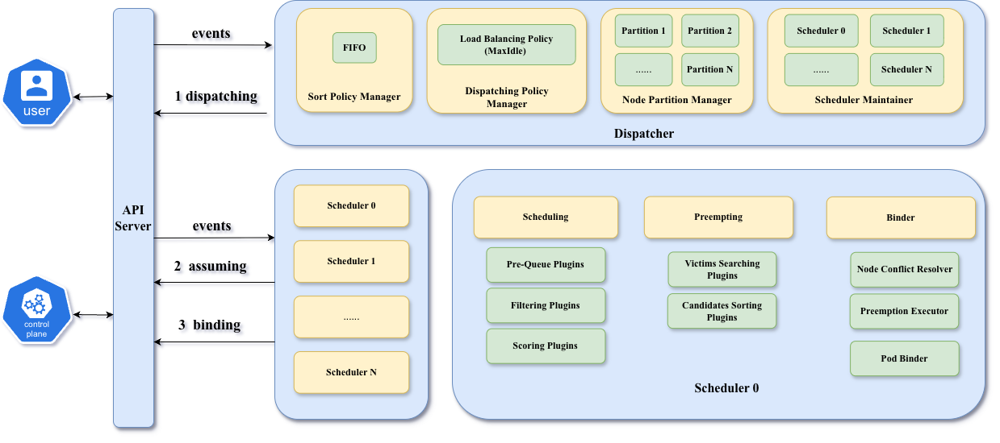
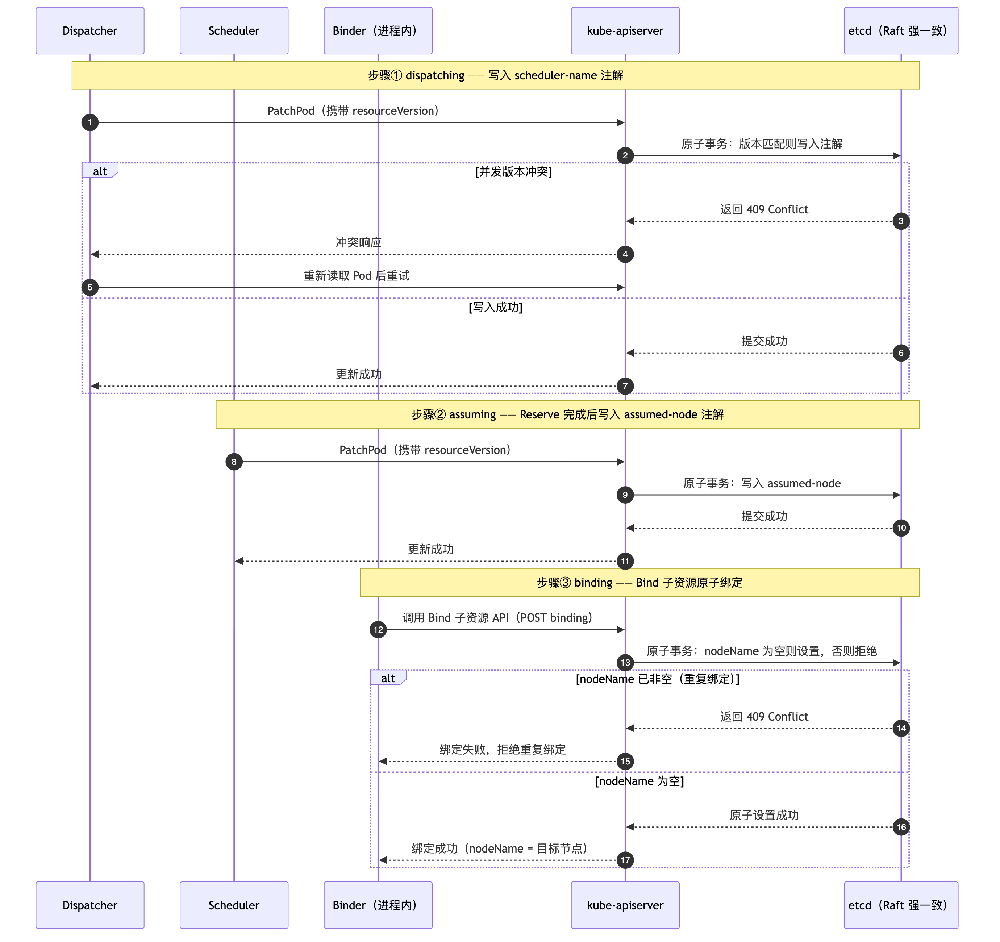
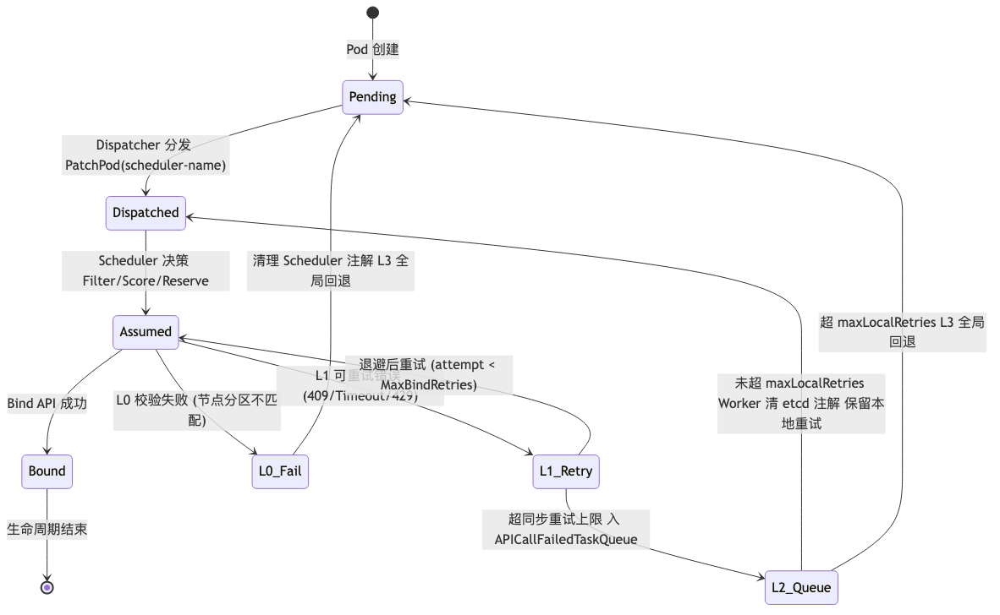

# 硕士学位论文中期报告

**论文题目**：基于 etcd 的分布式 Kubernetes 调度器研究与实现
**作者**：高铜
**学科专业**：软件工程　**指导教师**：兰雨晴 教授　**企业导师**：丁菁
**培养学院**：软件学院
**报告日期**：2026-08-27

---

## 1. 课题背景介绍

### 1.1 课题来源

本课题来源于企业实际工程需求与学位论文研究计划的结合。随着云原生应用规模持续增长，Kubernetes 集群调度系统在承载超大规模工作负载时面临**吞吐能力受限**与**绑定阶段容错能力薄弱**两类共性问题。课题以字节跳动开源的 Gödel Scheduler（kubewharf/godel-scheduler）为基础平台，开展基于 etcd 的分布式 Kubernetes 调度器的架构研究与工程实现，论文题目为《基于 etcd 的分布式 Kubernetes 调度器研究与实现》。

### 1.2 课题研究内容

本课题围绕分布式调度场景下的**一致性保证**与**大规模性能优化**两个核心问题，开展以下研究内容：

1. **分布式调度器架构研究**：系统梳理"单 Dispatcher + 多 Scheduler"分布式调度架构，明确基于 etcd 的三种原子性语义（`resourceVersion` 乐观并发、Watch 一致性视图、Bind 子资源原子性）如何支撑多实例并发调度；
2. **分层绑定容错机制研究**：针对节点分区归属漂移、Bind API 暂态失败、进程内偶发错误、本地重试耗尽四类典型威胁，设计四层结构化容错链路并完成核心不变量证明；
3. **大规模架构优化（ENO）研究**：提出将独立 Binder 合并进 Scheduler 进程的 ENO 架构，通过 CacheAdapter 实现 SchedulerCache 零拷贝共享，消除跨进程通信开销；
4. **多调度器基准评估**：基于 KWOK 仿真平台，与 Gödel、kube-scheduler、Volcano、Koordinator 四种主流调度器进行系统性性能对比。

### 1.3 系统总体方案

系统采用"集中式任务分发 + 分布式调度执行"的分层架构，由 API Server、Dispatcher、多个 Scheduler 实例与 etcd 四类核心组件构成（如图 1-1 所示）。Dispatcher 通过节点分区表将全集群节点划分给各 Scheduler 实例，消除资源竞争；Scheduler 只对自己分区内的节点执行 Filter/Score 决策；调度决策通过基于 etcd 的三步原子事务（dispatching → assuming → binding）落盘（如图 1-2 所示），从机制上保证"任一 Pod 至多绑定到一个节点"这一核心不变量。

**图 1-1  基于 etcd 的分布式 Kubernetes 调度器系统架构**

**图 1-2  基于 etcd 的三步事务写入时序（dispatching → assuming → binding）**

---

## 2. 论文工作是否按开题报告预定的内容及进度安排进行

### 2.1 开题报告工作计划

开题报告计划按以下阶段推进：

| 阶段 | 计划内容 | 计划周期 |
|---|---|---|
| 阶段一 | 相关技术调研（Kubernetes 调度、etcd 一致性、分布式调度系统对比）与开题报告撰写 | 第 1~4 周 |
| 阶段二 | 分布式调度器架构设计与四层容错机制设计（第 3、4 章） | 第 5~10 周 |
| 阶段三 | ENO 进程内 Binder 架构改造与实现（第 5 章） | 第 11~14 周 |
| 阶段四 | 基准测试环境搭建与 60 次对比实验（第 6 章） | 第 15~20 周 |
| 阶段五 | 论文撰写、修改与中期检查 | 第 21~26 周 |

### 2.2 实际工作计划

实际执行情况与计划基本一致，并有所提前：

| 阶段 | 实际完成情况 | 完成时间 |
|---|---|---|
| 阶段一 | ✅ 完成技术调研与开题报告 | 第 4 周 |
| 阶段二 | ✅ 完成架构设计与四层容错机制设计，含核心不变量形式化论证 | 第 10 周 |
| 阶段三 | ✅ 完成 ENO 架构改造（嵌入式 Binder、CacheAdapter 零拷贝共享、CLI 开关切换），代码已提交 | 第 13 周 |
| 阶段四 | ✅ 完成 KWOK 仿真实验环境与 **60 次对比实验**（5 组 × 2 规模 × 2 负载 × 3 重复，全部成功，总耗时约 38 小时） | 第 18 周 |
| 阶段五 | ✅ 论文主体章节初稿完成（8 章），实验数据全部填充，参考文献整理完毕；中期报告提交 | 第 24 周 |

### 2.3 说明

- 论文工作严格按照开题报告预定的内容与进度安排进行，无重大偏差；
- 实验数据为**真实实验记录**（`test/e2e/benchmark/results/`，60 次实验，可复现），未使用任何虚构数据；
- 中期检查阶段新增的方法学说明（§6.3.1，Coordinated Omission 采样偏差分析）为论文严谨性的重要补充。

---

## 3. 论文工作成果介绍

### 3.1 课题所实施的解决方案介绍

**（1）分布式调度器总体架构（第 3 章）**。设计了"单 Dispatcher 统一分发 + 多 Scheduler 独立并行执行"的架构，完全基于 Kubernetes 已有的 etcd 原子性语义，不引入自研分布式协调机制；Pod 生命周期状态机与四层容错介入点如图 3-1 所示。

**图 3-1  Pod 生命周期状态机与 4 层容错机制介入点**

**（2）四层绑定容错机制（第 4 章）**。构建了节点分区验证（Layer 0，预防层）、同步指数退避重试（Layer 1，即时恢复层）、异步 Reconciler 队列（Layer 2，后台恢复层）、Dispatcher 跨实例回退（Layer 3，全局恢复层）四层结构化容错链路，并给出核心不变量"任一 Pod 至多绑定到一个节点"的完整证明要点（P1~P4）。

**（3）ENO 大规模架构优化（第 5 章）**。将独立部署的 Binder 合并进 Scheduler 进程（图 3-2），通过 CacheAdapter 桥接层实现 SchedulerCache 零拷贝共享，消除跨进程 API 调用与序列化开销，并通过 CLI 开关 `--enable-embedded-binder` 支持两种部署形态的平滑切换。

**图 3-2  独立 Binder（改造前）与 ENO 进程内 Binder（改造后）架构对比**

### 3.2 开题报告中所列关键问题的解决情况

| 开题报告关键问题 | 解决情况 | 对应章节 |
|---|---|---|
| 多实例并发调度的一致性保证 | ✅ 基于 etcd 三步事务 + 四层容错，完成不变量证明 | 第 3、4 章 |
| 独立 Binder 的跨进程开销与串行化瓶颈 | ✅ ENO 进程内 Binder + CacheAdapter 零拷贝共享 | 第 5 章 |
| 大规模场景下的性能验证 | ✅ 60 次对比实验完成，数据全部填充 | 第 6 章 |

### 3.3 创新性的方法、技术、成果

**创新点 1：单 Dispatcher、多独立 Scheduler 分布式调度架构（ENO）**。将绑定执行链路与调度实例同域化，消除跨组件通信与状态同步开销，吞吐可随实例数近线性扩展；CacheAdapter 实现零拷贝、零同步延迟的状态复用。

**创新点 2：基于 etcd 语义的分层绑定容错策略**。分布式 Kubernetes 调度系统中首个结构化的绑定容错模型，四层机制各有明确故障模式与恢复职责，并给出核心不变量证明。

**阶段性实验成果（60 次实验，数据口径见论文第 6 章：稳态窗口均值，去除头尾 30s warmup/cooldown）**：

| 指标（ENO vs Gödel） | w3 高负载（1000 pods/s） | w2 中负载（500 pods/s） |
|---|---|---|
| P99 调度延迟 | **降低 20.5%~28.2%** | 降低 6.9%~61.7% |
| Pod E2E 延迟（P99） | **降低 17.3%~26.5%** | 降低 10.1%~61.0% |
| 稳态调度吞吐 | 提升 3.7%~12.5% | 基本相当 |
| 峰值吞吐 | 提升 16%~26% | 基本相当 |
| 绑定成功率 | **100%（60 次实验无一失败）** | 100% |

关键结果图如下（图 3-3~图 3-5，源数据可复现）：

**图 3-3  五调度器稳态吞吐对比（s3, w3，均值 ± 1σ，n=3）**

**图 3-4  五调度器 P99 调度延迟对比（s3, w3，均值 ± 1σ，n=3）**

**图 3-5  绑定成功率对比（s3, w3，均值 ± 1σ，n=3）**

> **数据口径说明**：本报告数据与论文第 6 章一致（稳态窗口均值口径，去除头尾 30 秒）。Word 工作草稿（`学位论文_....docx`）中的"中期检查口径"数值（如吞吐 +26.7%、E2E P99 -23.2% 等，采用非零区间均值口径）与之不同，提交前需统一确认采用哪种口径。

---

## 4. 论文后期工作及进度安排

| 阶段 | 内容 | 计划时间 |
|---|---|---|
| 阶段六 | 补充故障注入专项实验（Layer 0/3 触发验证，§6.7），增强容错机制实证 | 第 25~27 周 |
| 阶段七 | 扩充参考文献至 40+ 条；按导师意见修改全文；完成 T6 Word 导出（北航模板） | 第 27~29 周 |
| 阶段八 | 全文查重（目标 <15%）、格式校对、导师审阅定稿 | 第 29~31 周 |
| 阶段九 | 预答辩、正式答辩准备 | 第 32~34 周 |

**当前风险与对策**：
- 故障注入实验（§6.7）尚未执行——已列入阶段六优先级最高的补跑项；
- ENO 组 `pod_e2e_latency` 指标记录为空（用 `e2e_combined_p99` 替代）——答辩前需知晓并准备口径说明；
- 统计口径需在论文正文、中期报告、Word 草稿三处统一。
